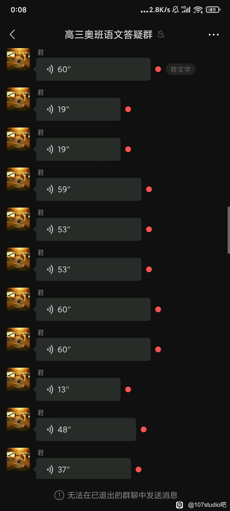
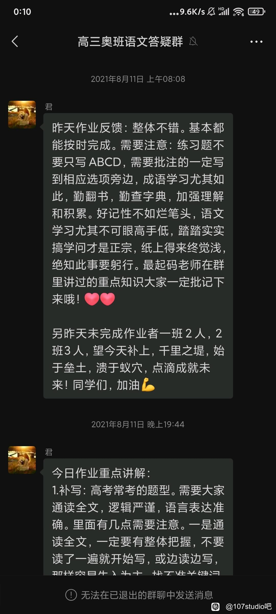
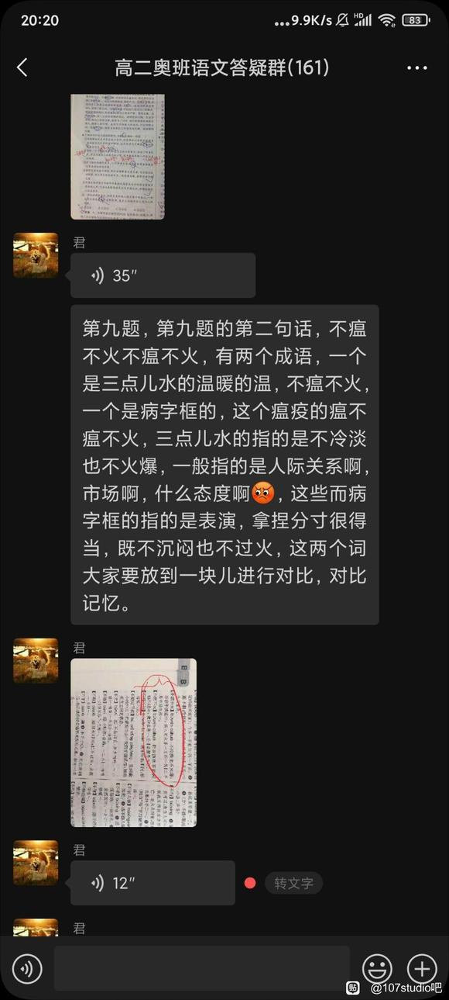
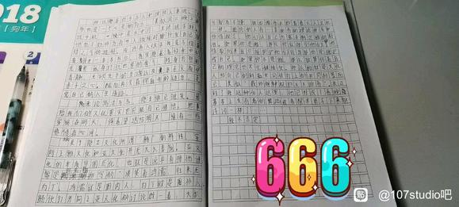
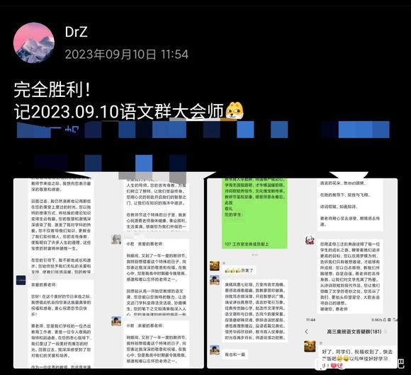

# 107抽象人物志：蔡师

编者注：本文可能采用双线视角，编者会尽力保证文章的可读性。

## 1 何许人也

蔡师，本名蔡某某，是我们的语文老师。我们开门见山，先说结论：蔡师其实是一个好老师，只不过，她算是比较抽象的时常犯病的好老师。

## 2 开学第一课

让我们从2020年9月开始讲起。初三毕业后，作者也是成功来到了这一个温暖的大家庭。我对语文老师的第一印象还算不错，毕竟，前几节课，就开始放视频看了。

先说前传罢。鼠鼠在初中时的语文老师是闫某老师。鼠鼠偶然从聪为那里得知，闫某老师和蔡师的关系非常好。好了，同一种老师要教鼠鼠六年了属于是。

> 酸菜鱼：
>
> 让我们把时间倒回到2020年，当时的我满怀着对奥赛班的憧憬，来到了sb的ayyz，命运的齿轮开始转动了……
>
> 当时的我还是一个天真善良，无忧无虑，可爱的小男孩捏。刚开学时，我第一眼就注意到了蔡师。我们的初中语文老师是一个大龄剩女，明明只有30多岁，却有着提前步入更年期的迹象。

只不过，这好印象持续到了视频开始放的时候。作为一部通过一名普通日本士兵和一名普通中国士兵在南京大屠杀期间的经历来揭示了战争对人性的摧残的历史题材的电影《南京！南京！》，蔡师在播放的时候随意的快进、跳段。比如，一出现某些她认为少儿不宜的内容，她就会跳过。以这样一种方式来对待一部严肃题材的电影，属实是有点不合适了。

## 3 沙扬娜拉

（以下为酸菜鱼视角）

与我的初中的语文老师的故事就一笔带过了捏（自己也忘了），但是当我第一眼看见蔡师就明白了，这位不太好对付。

正如酸菜鱼所料，蔡师在开学后不久就发力了。除了上面所讲的南京南京事件之外， 在11月份的时候开始讲起了近现代诗歌，其中林徽因、梁思成、徐志摩等人在蔡师嘴中是频繁出现。但是蔡师的调调，却让大家非常不满，典型的臭老九思维。

> 臭老九等式：我有才=我可以品行败坏

请原谅当时的鼠鼠还是个有着一腔热血的小朋友，但是乱搞男女关系的徐志摩等人让本人非常不耻，尤其是蔡师把淫乱说成了风流，把道德和才华混为一谈更是让本人十分愤恨，直接上不等式：我票唱≠我没有伟大人格。

后来，有几件事情将鼠鼠对蔡师的不满推向了高峰。

首先是蔡师发的补充练习中，包含了一首诗歌——徐大才子的《沙扬娜拉》（赠日本女郎）：“最是那一低头的温柔，像一朵水莲花不胜凉风的娇羞，道一声珍重，道一声珍重，那一声珍重里有蜜甜的忧愁——沙扬娜拉！”蔡师讲解时，说它体现了诗人某种情感（鼠鼠忘了，太久远了）。但是，这踏马的横看竖看，都像是去立本票完之后给🐔写的诗吧……

其次是蔡师从近代诗“两个花蝴蝶，双双飞上天”突然转到了现代诗。要知道，现代诗的内容更是离谱，诸如“面朝大海，春暖花开”之类的（流浪诗人昭子），还有涉及跳楼自杀、杀妻分尸等极端题材。当时的鼠鼠无比想攻击蔡师，但是苦于没有创作的经验，也没有整活的土壤，更没有现在的战友们团结在一起，于是乎这一次并没有掀起太大的浪，但是相信同学们在这一次的洗礼下也开始逐渐对蔡师不满了起来。

## 4 107工作室的成立

大家渐渐地发现了蔡师的逆天之处，再加上蔡师一篇篇“文章”和那攻击力极强的“口述小作文”，大家也开始写起了文章。著名的《凤君赋》、《讨蔡檄文》、《咏蔡集序》等文章如雨后春笋般涌现出来，一时间，班上掀起了品读文言文的高潮。蔡师自然是不知情的。于此同时，一首首诗歌词也出现在大家的视野前，如《江城子·反古》等。他们在尊重事实的情况下充分发掘蔡师的特质并加以放大，成为大家了解蔡师的启蒙读物，虽然只是片面的了解罢了。

> 这里附上《江城子•返古》：
>
> 蔡君任务学生狂：成语多，名言长；金考摘抄，作文列提纲。却遇东坡稼轩词，感情发，气势扬。 
>
> 无意教出状元郎，一零七，又何妨？然居现代，何时归盛唐？写作评讲限思想，八股文，放光芒。

同一时间，田师，李炜等流派也不断地在发掘自己的内涵。几大门派争奇斗艳，二班出现了百家争鸣的新局面。吏官们将他们搜集起来并存档，以供大家欣赏。以此为契机，107工作室正式成立了。

## 5 创作之路

（Dr.Z视角）

我仍然记得，我是怎么开始创作的。那一天，蔡师展示了四首诗词并赏析。由于蔡师应该是晚自习才过来布置作业，这一卑劣的行径，自然引得一片怨声载道。本鼠写完这些内容后，离放学还有二十分钟左右。无所事事时，我瞄向了大屏幕的第一首词：《玉楼春·别后不知君远近》（欧阳修）。“君”这个字激发了我创作的动力，于是本人就开始在草稿纸上胡乱地翻译后又强加解释，整出来一个叛逆的烂活。

但是，那张纸已经不可考，我也只记住其中的一首词。现在，我们一同来欣赏一下吧。

> 附上《玉楼春》：
>
> 别后不知君远近，触目凄凉多少闷。渐行渐远渐无书，水阔鱼沉何处问？
>
> 夜深风竹敲秋韵，万叶千声皆是恨。故攲单枕梦中寻，梦又不成灯又烬。

我不知道其他人是怎样走上创作的道路的；我是受到吧主的影响，外加蔡师的刺激，才走上了创作的道路，并有幸结识了灵气少年团的成员们。感谢蔡师。

（酸菜鱼视角）

我是怎么走上的呢？蔡师当时在讲阿房宫赋，说如果高考也能以赋的形式分就会很高。当时鼠鼠十分讨厌蔡师，一节课一气呵成前半部分，后来就搁置了这部伟大的作品。再后来不知道哪一天，本人已经创作了凤君不要等作品，突然翻出来了凤君赋，当时正好李炜老师提供了107的梗，本人才思泉涌，下笔如有神，直接写完了后半部分，全班流传。

## 6 金谷园

时间来到了高一下第二次阶段考。在这一次，蔡师在作文上依然犯病。这一段时间里面，蔡师进行了她关于《滕王阁序》的讲解。通过蔡师的讲解，我真切地体会到了王勃的灵气过人，但是，蔡师明显用力过猛。“金谷园”“香料美女”等内容蔡师大加篇幅地进行讲解，而有些内容，则是一笔带过。那段时间，大家“厕所社交”时，往往会戏称去“金谷园”。

## 7 红楼梦

马上出场的，则是蔡师关于《红楼梦》的讲解。1964年 8 月 18 日在北戴河与几个哲学工作者谈话中，伟人说：”《红楼梦》我至少读了五遍。我是把它当作历史读的。开头当故事读，后来当历史读。”1967 年 10 月 12 日同外宾的谈话中，李德胜同志又说：“不了解点帝王将相，不看古典小说，怎么知道封建主义是什么呢？当作历史材料来学，是有益的。”显然，蔡老师是真真切切地把这本小说当作历史资料来对待——也有可能是教学安排——不管怎样，她还是认认真真地在五、六月份进行了讲解。

蔡师认真地讲，底下的同学们却不认真听——当然，还是有人听的。我很是讨厌看这本书，大抵是自己的阅历不够罢。我们亲爱的吧主，在书里面发现了一些奇怪的东西：比如说，第28回薛蟠创作的女儿行令。😆😆😆茶余饭后，大家总要揶揄一下，一方面是为了找乐子，另一方面，也是为了缓解一下压力。（虽然，也是找乐子）

> 附上原本的内容：
> 云儿笑道：“下两句越发难说了，我替你说罢。”薛蟠道：“胡说！当真我就没好的了！听我说罢：女儿喜，洞房花烛朝慵起。”众人听了，都诧异道：“这句何其太韵？”薛蟠又道：“女儿乐，一根<毛几><毛巴>往里戳。”众人听了，都扭着脸说道：“该死，该死！快唱了罢。”薛蟠便唱道：“一个蚊子哼哼哼。”众人都怔了，说：“这是个什么曲儿？”薛蟠还唱道：“两个苍蝇嗡嗡嗡。”众人都道：“罢，罢，罢！

## 8 网课大师

高一升高二的暑假里，蔡师开发出了网课方法。蔡师每天会在网课里面布置今天的作业，并于每天晚上在创建的语文网课群内进行答疑。这个群存在了两年半之久，最后，也是被灵气少年团的成员们玩坏了。

蔡师每天都会更新学习内容，就像这样：

或者鞭策、激励大家，就像这样

2021年8月10日，著名的“什么态度啊”横空出世了。

但是，我们的蔡师十分敬业，每天都发布这些内容。也许有人会说：这是她的工作；但是，她本可以不发这些内容的，就像田师一样。而她仍然每天高强度更新，确实令人敬佩。虽然我也没有功夫听完这些内容，但是，我还是语音转文字，看完了绝大多数内容。

## 9 转角遇到蔡

其实，蔡师正常的一面也是很不错的，比如说，她在课程上面的设计。大抵是她也考虑到没有人会听她讲又臭又长的《雷雨》《哈姆雷特》《窦娥冤》等课文，蔡师决定，大家自己准备并自己划分小组，在她的语文课上面进行演出。虽然有些人认为，这种东西无趣又累人，但是，在当时的情况下，这无疑是一个好消息。

很快，大家完成了分组，并于中秋节前后进行了排练——当然，你可以称之为是线下面基。在这之中，还有一个很重要的因素是大家的作业也快写完了。恰逢那几天下雨，市局下发通知，禁止一切的补课活动。大家在学校使用自习课的时间将作业完成大部分后，又等来了放假的通知，这难道不是一件开心的事情吗？

这中间还有一个小插曲。那天结束后，我和光哥、b哥去便利店里面坐着玩mc。光哥正在喝酒的时候，突然先后遇见了稍微同志和蔡师。我们三个紧贴着便利店的柱子，紧盯着监控大屏，不想和蔡师打照面。

这种活动的乐子是真多。最后，戏剧活动也算是取得了圆满的成功。

## 10 说德道礼之大踏步后退

时间来到了2021年10月。果然，一个人在神的位置上坐久了，她就不再能称神了。二班的“讴歌”对象，也从蔡师转移到了zyj上面。但是，只要蔡师一声令下，所有人的目光终究会向她看齐的。

仍记得是某个星期四。（经考证，实为2021年10月14日）蔡师对孔子问题进行了一场大讨论。蔡师想让大家对孔子和书里面的句子作一些引申，并让大家畅所欲言。结果，大家对孔子几乎是直接开骂，认为他已经跟不上时代了。（这不是废话吗）蔡师自然不想看到这种东西发生在自己的课堂上。他抓紧挽救课堂，企图用片总、班长和牢b挽回局面。但是，一切都是徒劳的。在大讨论中，蔡师也败下阵来，承认了孔子的郑志思想对今天的贡献为0，但是，她所强调的修身养性的思想依然“受用”。在此之后，蔡师忽然打住，用不到20分钟的时间里速通了整节课。

当然，我也是笔耕不辍，一节课的时间里，把大家发言的内容几乎都记录了下来，算是对这个“生命哲学”课程的感悟罢。

蔡师让片总起来回答问题的时候，我能明显地观测到，蔡师的脸由黄变绿再变黑。正当我赶紧让大家看的时候，被蔡师狠狠滴瞪了一眼。

蔡师让LB回答问题的时候，一直夸他文章写的很好，思想很有深度。可是，在他回答完问题之后，蔡师只是毫无感情地说了一句：“坐下吧。”

在这里我要说一下：任何将孔牢二的郑志思想带入当今社会的人，都是Anti-Revolutionist；任何用孔牢二的人格修养要求他人而不约束自己的人，都是Bitch.

紧接着，蔡师就开始发一些阅读资料了。仍记得孔子那一篇阅读资料是十分令人高血压的。我们一边看，一边骂，还一边撕毁这些资料。有关孔子的那一篇资料已然不可考了，但是，关于孟子的资料我们还是留存了下来。这篇文章气势磅礴，非同一般，舒适给我留下了深刻的印象。

> 文章指路：
>
> [经典阅读：孟子——王者师与大丈夫](https://blog.sina.com.cn/s/blog_c2b36eb90102vpj1.html)

蔡师继续在复古思潮上大踏步地“向前进”。在讲到孟子时，蔡师花了一节课的时间来论述“大儒似酒，一醉千年”的观点；在讲到《逍遥游》的时候，蔡师则是高亢地谈论起庄子对自己人格的塑造。在这一点上，我表示认同，毕竟，这些思想家确实是某一种思想范式的代言人，现在讲述这些，也应当是正确的，能够让大家了解到中国的传统思想文化。只不过，这种思想，要不是早已落后于时代；抑或是超出了十六七岁的青年人所能理解的范围。

当然，我也是学习到一点的：“三日不读书，面目可憎！”
这是蔡师的老师怒斥蔡师等同学不好好学习的话语。所以，每每蔡师面目可憎的时候，大家总会搬出来这句话在底下调侃蔡师。

## 11 年底了，冲冲业绩很正常吧

到了年底的时候，蔡师不正常的情况又渐渐显现出来。先是恶意克扣我们的阅读课时间，又是在讲台上，在作业里面发电。在年底最后一次阅读课（2021年12月30日），蔡师更是整了一个大活。蔡师将阅览室的空调设定成了制冷模式。

> [@YZfengtai:](https://github.com/YZfengtai):
>
> 曾记，在一节阅读课上，当时不知道为什么比较冷，大家都把帽子带上了，蔡师很疑惑，就去问一个同学为什么要戴帽子，他指啦指空调，蔡师恍然大悟，原来开的是冷风，冬天，冷风！

不得不说，蔡师还是有点抽象程度在里面的。不过，最令人欣慰的一点就是，蔡师明白承认错误。这可比开热风而不承认自己开热风的某两栖类东西好多了。

## 12 网课二阶段

2022年1月，又是网课时间。蔡师又又开发出了一个新招：关心学生。蔡师会对“重点学生”着重地关心和照顾，就像这样：

这里附上作者问蔡师的那一首诗：

> **次韵蒋颖叔**
> 宋 苏轼
>
> 月明惊鹊未安枝，一棹飘然影自随。江上秋风无限浪，枕中春梦不多时。
> 琼林花草闻前语，罨画溪山指后期。岂敢便为鸡黍约，玉堂金殿要论思。

其实，蔡师每一天的作业量还算比较合理的。蔡师没有让你一天写一张卷子，而是两天写一张卷子。这足以看出，蔡师其实还是比较好的。

> 鲟哥视角：
> 想起来当时每天的经典作业，唐之韵：
>
> 1月22日语文
> 《唐之韵》李白、杜甫观后感各一篇，写到随笔本上，每篇不少于500字。周日晚上7点前拍照上传。

## 13 隐士文化

时间来到了2022年3月。讲完了必修部分的蔡师开始教授选修部分的篇目——文言文+诗歌。2022年3月初的某一节语文课上，蔡师不知怎的，讨论起了关于隐士文化，并让大家就上一周周末搜集的内容来发表自己的看法。蔡师自然是不去管大家想要说什么的；她只是自顾自地讲能够令自己颅内climax的内容。蔡师先是说王阳明怎样，隐士怎样，什么超凡脱俗、气势不凡啊、孤芳自赏啊之类的词语信手拈来，引得底下骚乱声此起彼伏。

我到现在还记得那一天说的某些雷人语句：

- 蔡师说自己很有隐士的色彩，“我的最大心愿就是去海边开一家书店，每一天就坐在海边看着日升日落。”看看，多么地超凡脱俗啊！

- 那一天，我们的主角喊出了那八字箴言：“***Revolution is innocent; rebellion is justified!***”

自然地，那个周末，蔡师布置了随笔，让大家各抒己见，发表一下自身的看法。现在，可谓是大活来了。我们好好滴发挥，并特地将我们的作业本放在了一起，准备给蔡师打出一个连招。这里，大家可能发现了吧主的文章似乎有偏题至嫌疑，实则是作者有意为之的：蔡师于11月份，分析过“雅”“俗”文化，并对亚文化颇有微词。我们吧主就在此时联想起了之前的内容，决定好好地论述一下他们之间的关系。

结果，这篇文章蔡师非常喜欢，并夸他“新颖”。鼠鼠的文章因为用力过猛，被蔡师含沙射影地在课上批评了。不过，据吧主所讲述，关于这篇文章，她其实并没有很是喜欢，批语是前半部分很有想法，后半部分过于偏激。

2022年5月，蔡师先是线上教学，后复课为线下教学。这一段时间里，蔡师非常正常。不过，蔡师的正常衬托出了其他人的不正常。

看看蔡师负责的态度罢。下面的内容全部是蔡师在网课的时候讲述的：

> 刘过作为一位南爱国志士，平生以匡复天下，一统河山为己任。他力主北伐，曾上书宰相，痛陈恢复中原的方略，但却不被苟且偷安的当政者所采纳。他自己也屡试不第，一生布衣。因此他浪迹江湖，直至当时南宋前线重镇襄阳。这首《贺新郎》大约写于词人西游汉沔（今武汉）时。
>
> 作者运用“弹铗”的典故，以冯谖自比，自己独自向西走，写出自己浪迹江湖依人作客而得不到主人重视所产生的愤恨。因此才怀着愁苦，冒着辛苦而西来，足见其处境的可悲。从而也唤起他对家乡的思念。“梦里寻秋”四句承“西来路”，说他在外地漂流，梦里也思念家乡，寻找家乡的秋色，却一直未见到，醒来只见秋色在远离家乡的“平芜远渚”。梦中寻找秋天却不见它的踪迹，不想秋天已经来到了这平芜远树上了。秋日南飞的大雁起起落落，而我的家园山河又在哪里呢？

## 14 偶遇骇客，拼尽全力无法战胜

2022年6月，一节下午的语文课，蔡师正在讲古诗。因为是连着上第二节课，大家都蚌埠住了，不是睡觉、写作业，就是开小差。这一切，直到某位大神出场——海客。

蔡师问了大家某一首诗里面渲染情感的句子应该如何赏析。蔡师奇迹般地点到了海客。

海客说：“可以用一下三句诗来说明：

1. 鸡声茅店月，‘疑是’板桥霜；
2. 人影在地，仰见明月；
3. 雄鸡一唱天下白”。

这一下，班里集体活跃起来。蔡师都蚌埠住了，海客的逆天发言，硬控大家30秒，并把蔡师的cpu干烧了，蔡师站了好一会才说话。

## 15 十成十

高三。蔡师在高三开始的时候，明确指出了大家和高一、高二已经不一样了，应该将更多的精力放在对语文考试内容的学习上了，所以，会更加严厉了。

大家刚开始没有感觉出来，直到在某一节课上，蔡师使出了终极大招，大家才明白；而且，大家也将会明白，这绝对不是蔡师的最后一次。

让我们把时间拨回到2022年8月某天上午。蔡师在早读的时候告诉大家，自己今天要去+1开会，估计上午的课只能上一半。1班的同学上自习，随后补课；2班的同学先上『语文』自习（只让学习语文），等蔡师于后半节课回来后继续讲解疑难部分，不用补课。

这一波，2班算是赚麻了。不过，大家不懂这点，直接给蔡师整了一个最大的活。

上课后，大家都在自己看书。可能是上一节课刚刚布置了作业，大家都准备开始写作业。当然，也是有一小部分在看语文资料。大家学习得太过认真，以至于完全没有发现蔡师正在逼近了属于是。其中，我们的“主角”整的活最大：主角和丑哥俩人坐第一排贴脸开大，比谁数学写的快。

蔡师推门进来，满心欢喜地。不过，一个、两个、三个…一群人，都在写其他科的作业，这让蔡师大为恼火。蔡师于讲台上发表了著名的10分钟演说。由于事发突然，没有留下有效的资料，不过，我清楚的记得下面的几句话：“你们变得连老师也不认识你们了”“好的东西不学，坏的东西学了个十成十……

蔡师发完火之后，就下课了。下节课正好是自习课，蔡师就直接把他占了😭😭😭

## 16 萨满

蔡师在文言文复习的过程中，会穿插对某些小说的点评。蔡师还想出了一个非常逆天的方法：蔡师不讲课，抓同学们上来给底下的同学们讲解文言文。

这时候，吧主的优势又一次发挥出来了。有一次周练阅读理解，大家都是3-5分的情况下（满分12），吧主直接拿到了11分的高分。对，是那个关于萨满的题目。蔡师邀请吧主上台讲解题目。

蔡师犯病的频率是固定的。到了9月份第一次阶段考试结束后，面对大家不忍直视的语文成绩，蔡师给出的惩罚是：

> 开大。

## 17 蔡师八分钟

那一天评讲完语文试卷之后，还剩下十分钟左右的时间。于是，蔡师就开始了她著名的八分钟演说。

> 咱讲题为啥一直在呵呵笑呢？咋你觉得很好笑吗？你觉得很有意思吗？这咋选个成语就觉得，看不上这个题，这有啥可笑的？如果你要是真的不屑一顾，请你先考到140分再说，你别拿这么90分的，拿了100分的样子，天天玩世不恭，谁也看不上。你先有能力解决了再说。都不是踏踏实实学习的样。都觉得自己很了不起是吗？我给大家说一个现象。嗯，这次的语文最高分，嗯，不是咱们主校的啊，因为当时我看的时候只看了这个主校。后来我才发现看单科成绩的时候最高分是新一的139分。139。然后我就这个把这个学生的答题卷就调出来，我看了看。她的答案几乎跟标准答案一模一样，然后呢。就给这个她的任课老师就打电话啊，然后我就说我说你们这个学生这个程度怎么样了？然后我说她平常表现怎么样？然后那老师说这这女生非常勤奋，非常勤奋，很努力，很踏实。然后这女生是怎么样的？她是河南省就是出来的，每一次就是各个联考，就地市联考的试卷。她都自己打印出来，自己刷题，自己做一遍，所以。哎呦，这个可能放在这这不光是语文一科是这样子的啊。这个各科都是这样子的，她的总分，她是文科生，她的总分排在四个校区的第9名。其她的政史地啊正是你人家全都是几乎那个跟答案那个句子语言都是一样的，用词都是一样的。然后我就问她，我说是有可能人家刷过这种题，或者人家作弊了，或者咋样的，不可能说人家跟答案上完全一样吧。突然间她告诉我她们也怀疑，可定也怀疑了这个这个事儿到底直接可信不可信？然后有人就自己命题，自己出题，原创，然后来考这个学生，然后这个学生呢，写出来的句子也几乎跟老师想的一模一样。所以我觉得两个方向啊。这个女孩是什么呢？她，她当时让学语文的时候，直接就就要求她说。你这个，你说吧。你的这个程度你要考到多少？然后她说，我要考140。好，可以，那你就考140。然后就努力陪着你（？）给她想好了一个人说她就刷题。然后是整理题。每一道题怎么把语言怎么组织怎么能写出来。然后这这这这个女孩呢。其她题也是一样的，其她科也是一样的。嗯其她的这个历史老师啊政治老师啊反正也出题。反正文科那些题嘛。相对来说比较灵活，都是主观题。老师也出题，考她也是跟答案。几乎完全一致，我觉得我现在就缺这个。大家现在学习一个我觉得很机械，另外一个。没有一个高的目标，我就要考到多少分。而且反而还想往下掉。我就觉得我这就挺好的了，我就觉得就这就差不多了，就这就行了，就好想跑往下掉了（？）。你要基础。咱既然能考到奥班来，基础肯定不差，可能个别学生语文上有弱科。那你单独补，但是整体上，还是要比我们普班好多的，所以我们自己得有一个信念。我就要考到我就我就得去弄，我弄到140我弄到最起码130。就在高考的时候才有竞争力，要不然语文压根你就拼过来。你再拼吧，拼拼拼到后期考综合，我能考满分吗？大概差不多是270分左右，数学基本上也就140分了差不多。语文我考一百零几，人家考130。你各科都要强才行，你都得往上弄。这就今天的这个样子。就这嘻嘻哈哈的样子，就这讲一句在那笑十句的这个样子。我说，你要有能力。你要不听话，考到了130分，再说，你要真考了130分，可以，你可以不听课，你可以不交作业。啥都行。你要是考到130分，你就老老实实的先把该完成的任务完成。不听话到时候害的都是你自己。我还是那句话，跟着老师的节奏走。是最高效的。好了，下课吧。

## 18 咣当咣当

时间到了2022年10月份。蔡师中午上完课后紧接着是自习课。蔡师回到了办公室，我们的吧主也随后去了办公室。他回来的时候，潇洒地把门带上，发出了“咣当”的巨响。半分钟后，蔡师直接怒气冲冲地走到班里面，怒斥到：“恁关门的时候就不能轻点？咣当咣当、咣当咣当的，就不知道影响大家学习吗？”当时我和指导大人在后门镇守着，着实被蔡师吓了一跳。不过，这里，我们也拿到了蔡师的一手资料。

> 注：此音频资料请移步到下载专区获取。

这段时间，蔡师还说了“叶子红了”（杏子红了）、“万岁万岁万万岁”等累人语句。不过，录音的设备毕竟不是给蔡师准备的，而是给wb准备的。

## 19 最后一次网课

2022.11，这一个月可谓是很不安宁。大家频繁地处于停课/复课的循环中，谁都不知道究竟什么时候会结束。我们的蔡师，在上课时十分敬业，在上网课时，也是尽力给大家找能够鼓舞人心的文章，美句。不过，蔡师仍犯了一次病——发了一次关于陆游的癫。不过，这可能是他最后一次发有关人物的癫了。😭😭。文章名叫《陆放翁，生日快乐》。

2022.12前期，网课。2022年12月9日，海客被蔡师抽查到背诵早读内容。下列内容在海客篇已写过，故这里不再赘述。

## 20 字面意思上的前仆后继

复课后，蔡师是为数不多地挺到了决赛圈的老师。由于大家天天上自习课，加上班里的人也是越来越少，所以碰到一节能够活跃思维的语文课也是一件幸事了，虽然以前大家很多人是不愿意上的。而我们的蔡师也非常地尽责，每天仍坚持来班上辅导，甚至代替wb这家伙管班。

过，蔡师终究是倒下了。在大家走得都差不多之后，蔡师也倒下了。等到大家全部回来后，蔡师不见了，取而代之的是一个男老师（详见之前dlc更新内容）。他讲的太好了，以至于大家都无比地期盼着蔡师回来给我们上语文课。

蔡师没有好利索就又来上课了，这点必须点赞。

## 21 最后

最后一学期的时候，蔡师好像没有整什么大活，毕竟，每天都内容都是重复的，大家也在一次又一次的听蔡师讲课、讲卷子的时候麻木了。

最后一节语文课，蔡师也是强调了几个点就便没在说什么了。在考前，蔡师给我们留下的就是几份资料了。有时候，离别就是这样，没有轰轰烈烈地，只是平淡的——平淡地你甚至都会忘记。不过，当你回味起来时，总会有一股伤感涌上心头。

各位，这个107工作室，是真真切切地靠着蔡师才建立起来的。我和大家都是在一次次的切磋、琢磨中熟悉的。所以，没有蔡师，就没有107，也没有这些看似曹丹实则充满着几丝美好的回忆，没有我们这样深厚的友谊。蔡师等人是极大的推动者。我们真的要谢谢蔡师。😭😭😭😭

所以，在教师节到来之际，大家给蔡师送上了节日的祝福。蔡师十分感动。不过，那个群里面还有另外一位z姓老师，不知道她会作何感想捏？

## 22 最后的最后

我们的吧主在12月份开发了一款微信机器人。在元旦晚上当天，他把机器人接入了蔡师的微信群。群友们纷纷让机器人给蔡师送上新年祝福。可能是凌晨手机还在响的原因吧，蔡师发现居然是这一群小子在搞事，于是把我们的微信群解散了。

和她最近的一件事情是在1月24号回学校的时候，我们计划带着旗子和蔡师拍照，结果蔡师因为要开会无法拍到照片。

总的来说，我还是非常感谢蔡师的，虽然有些时候她会犯病，但是大部分时候还很正常，并且给我们带来了一种新的语文体验，这是以前从未有过的。

那么，此贴……终结。