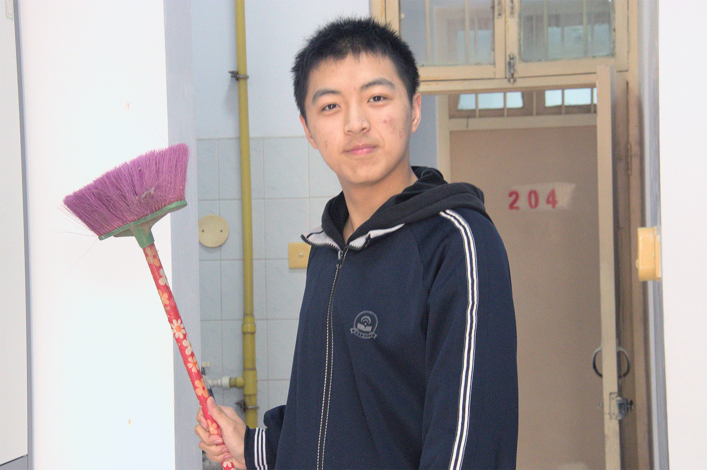
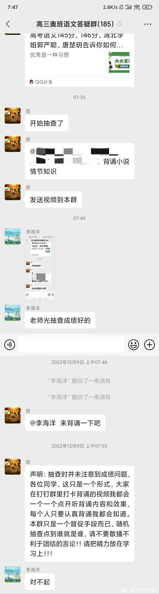

# 107抽象人物志：海客

## 1 写在一切之前

> 海客谈瀛洲，烟涛微茫信难求。
> 越人语天姥，云霞明灭或可睹。
> 天姥连天向天横，势拔五岳掩赤城……
>
> 
——李白《梦游天姥吟留别》

从《梦游天姥吟留别》开始，海客一词算是正式进入了汉语的大家庭，并在千百年来语言的发展中，演变出了以下的意思[^1]：

> 1.  [voyager]∶ 经常出海航行之人。海客谈瀛洲,烟涛微茫信难求。—— 唐· 李白《梦游天姥吟留别》
> 2. [tramp]∶ 居无定所的江湖人。

然而，在高一的语文课上，刚刚噫吁嚱（yi xu hu）完的鼠辈们，无论如何也想不到，海客会以另一种姿态，穿越尘封的历史，向我们走来。

## 2 生平

海客，又名骇客，真名李某某。他与本鼠在初中就是同校同学，上了高中之后升级成了同班同学。本鼠在初中的时候就久仰李某某的大名了——只是好坏参半。

具体来说，有以下的几个方面：首先，是鼠鼠的初中政治老师政治课在中考前的几乎每一堂上都会表扬海客。这个老师也算是一个神人了。具体有多神？大概就是考到了政治91%的分数仍会被打电话叫家长这种程度的罢。神人老师总是夸奖海客，说他“认真、努力”，并趁机贬低其他同学。

然而，与之相对的，则是海客在班级内的风评。据海客的初中同学讲，海客在他们班的风评并不好。

他经常会在课堂上大放异彩：大喊大叫并拍手称快——颇有“我本楚狂人，凤歌笑孔丘”的放荡不羁与洒脱——只是他比起大诗人李白，更像是唐氏儿。

此外，他们又向我抱怨道海客对于生化武器的掌握已然达到炉火纯青的地界了。海客总是喜欢在课上违反《禁止生物武器公约》，导致在一段时间内，班级内的浓度严重超标，同学们的生存环境受到严重威胁。

大家不愿意理他，很大程度上是他在语言文字应用上的强大能力。记得我在初中的时候，每一回总能听见一个Antimony在门口喊“同志们好！”“同志们辛苦了！”之类的内容，令人很是难绷。

不过光有这些“丰功伟绩”，在我们初中，也是属于是名不见经传。真正让海客一战成名的，也是海客在初中阶段给我留下最最最深刻的印象的，当属是海客在厕所里踩了卸特的故事。

## 3 谢特达人！

这里，我们先要讲一下黄龙道长的故事。鼠鼠初三那年，6班的某同学经常把环卫工人清理干净的地面拿来作为它的背景板，在上面创造着自己的杰作。他总会使用自己的棕色或黄色颜料，在大地上，挡板上和坑外面搞着自己的艺术作品。因为他会在板子上写上“黄龙”，所以我们尊称他为“黄龙道长”。（真可谓大名鼎鼎）

日子一天天过去，黄龙道长也“笔”耕不辍地创作着。直到有一天，走廊里回荡着“李海洋踩史了”的声音……

据别人说，海客中午总会去撤硕开大。可能是海客实在忍不了了罢，估计是没有看清楚就冲进了撤硕，黄龙的所谓杰作也被他给亵渎了。等到海客发现时，肯定在大喊大叫罢……然后，海客“就在用那个小便池上方扎了孔的水管里流出来的水冲鞋”。

一些同学看到了，纷纷奔走相告。也难怪，作为初中生，这么抽象的事件，恐怕也没几回罢。有免费的猴戏看，何乐而不为呢？

## 4 海客丝滑小连招

万万没想到的是，就这样的一个人，竟然是我们的高中同班同学。不过，也许是上了高中稍微收敛了一些了罢，海客在高一、高二的时候，至少没有在明面上给鼠鼠恶心到。所以，让我们直接进入高三阶段。

在高三阶段，海客抽象水平与日俱增。这里，我们只好多线讲述。

首先要介绍的，便是海客自主创新的丝滑小连招——即前摇、喷嚏、鼻涕和最后的后摇。

海客的第一招前摇一般是以“呵”或者是以抠鼻孔开始。这预示着他要准备打喷嚏了。

对于第二招，这个b算是把“不鸣则已，一鸣惊人”给学明白了——使用短促而且洪亮的喷嚏声向全班宣示着自己的存在。每每响起一声喷嚏，大家都会把头转过去，同时嘴里咒骂着海客。而海客根本不鸟大家，人家只是自顾自的，“千磨万击还坚劲，任尔东西南北风”。反倒是大家还需要看海客的脸色，期盼着他不要再打第二次喷嚏了——尽管，这多半是徒劳的。这一阶段为cd期，他是安静了，但是只是暴风雨前的宁静。

> 许浑有诗：“溪云初起日沉阁，山雨欲来风满楼。”

曾记得在高三，我和另外的鼠鼠们猜测海客一天到底能够打多少次喷嚏。本鼠才14次——最后本鼠和b鼠猜对了。当然，剩下猜错的鼠鼠们，到现在也没有🔒word🐮🐄。

继续讲海客的丝滑连招。第三招是擤鼻涕。海客不知道是怎么了，在一段时间内，他经常在擤鼻涕。他擤鼻涕的时候，先从自己两个裤兜里面随机拿出一张纸，然后双手将这张纸自上而下覆盖在鼻子上，然后用力的擤啊擤啊擤啊擤。此时，全班的目光都会集中在他身上。他仍然沉浸在自己的世界里，直到擤完鼻涕为止。

然后，就是最后一招的showtime了，他会将鼻涕纸重新叠好，放入两个裤兜中的某一个。有时候还会翘着辟谷，不知道盯着谁出神。

不过，海客的丝滑连招总是会引起大家的侧目，有时甚至是老师的。我清楚地记得有两次，海客一直在擤鼻涕，而且愈来愈响，讲台上讲课的数学老师也蚌埠住了，转头看向海客。海客就在全班人的注视下擤完了鼻涕。

> 讲到这里，我突然想起2012年伦敦奥运会憨豆先生也上台表演了。他也擤鼻涕了，并把用过的卫生纸扔到了钢琴里面。
>
> 在某些方面，你们两个挺像的：都能给人带来乐子。不过，更大的不同，是处处不同。人家Mr.Bean是牛津大学的高材生，来演傻子的；你是发育不完全的类人，来演人的。

## 5 海马组合

做了这么多，那么代价又是什么呢？其实，他只是想引起马姐（马某某、或称哈基马，猫孝子、Major、MJ等）和他心中臆想的女生的侧目。海客和马姐的故事是一个十分微妙的平衡。

骇客和Major的故事，还要从2022年12月份开始讲起。由于公共卫生事件， 当时骇客和Major中间的同学都不幸罹患某冰，于是撤出了战场。

两人周边大概三米左右都没有人，处于疫情下的恐慌和不安加上封校的无聊，两个人开始了接触和联系。

一开始只是Major主动找骇客聊几句，后来骇客开始逐渐感知到自己的抽象令人欣赏，在某日下午大课间向Major发起了总攻。

（牛子视角）当时本鼠坐在高一一班一进门的位置，靠窗最后一排有暖气片，当时光哥，培源，博士，鲟哥与本鼠经常在此处取暖。当本鼠把爪子放在暖气片上时，Major正在和骇客讨论语文，这是骇客开始了他蓄谋已久的计划。他的手慢慢的掏出了自己的水杯，询问Major要不要去接水，这时Major大喜过望，遂和骇客下楼。那时班里基本没人（都出去了） ，两人一起下楼时，本鼠在自己座位上都听见了骇客的笑声。

## 6 天马行空

大抵是高三学业压力重，而海客的手机被海亩收走了罢，海客逐渐发展出来了一种意淫的新技能。具体来说，海客会进行无实物的OGC。

之前，据龙哥等人讲述，海客拥有一个驴叼。果然，瑞典原神定律又一次应验了。在端点原神里，绿袍尊者的鼻子是什么样子的就不用本鼠多说了吧。[^2]

根据J.B.拉马克的理论[^3]，海客一定是用了很多次吧。记得某一天，KY同学带领着一部分同学进行了一次卢关问题的大讨论。海客很是自豪地说自己平常进行无实物表演。

当大家问了他如何操作的时候，他说出了一句令人永生难忘的话：

**我真为你们贫乏的想象力而感到悲哀。**

此话一出，在场所有人全部都绷不住了。之后就是死一般的寂静。

## 7 循声守卫

在Minecraft中，有一种高大而危险的敌对生物，会根据振动和气息判断生物的位置。它就是监守者（循声守卫，Warden）[^4]。

这种东西十分烦人，因为它可以感知到物体振动并寻找振动源的位置，或者嗅探周围存在的生物，并径直地朝它们走去。海客，在某种意义上，也属于一个循声守卫了。

具体来说，骇客和坚守者有许多的相似之处：

> 1. 大家看到它们都会绕道而行；
> 2. 拥有较强的声波攻击能力，可以穿墙；
> 3. 会主动嗅探猎物；
> 4. 一个是血量极其厚，另一个则是脸皮极其厚。

### 7.1 绕道而行

在高三下学期的时候。我记得**有两回**，我们十几号人在201谈天说地，好不热闹。海客突然出现在宿舍门口，让正在兴头上的大火们直接寸止住了。海客带着笑容走过来了，随后就发出了疑惑：你们在说什么呢？这么热闹。宿舍里面十几个人面面相觑，谁也不愿意回答海客的问题。海客发现自己自找没趣之后，就自己溜走了。

从震耳欲聋到鸦雀无声，有方法的老师可能需要十几秒，而海客，只需要一秒。

更不用提每次作文素材到班里后的前几个课间了。这个奇行种总会以一种抽象的动作去到讲台上，然后拿起时文选粹的第一本书，趴在一堆书的顶上就开始看。值日的鼠鼠和课代表都不敢动这个贵物。整个讲台上面就剩海客一个人，趴在前面的保险柜上面，翘着辟谷，自顾自地享受着。那一瞬间，我仿佛看到了王自如：“WoW ~ Awesome ~ OK ~ 这是我独享的Moment ~ ”[^5]

### 7.2 较强的声波攻击能力

每一次大家在教室里面安安静静地自习着，突然间就能听见教室外面传来一串“银瓶乍破水浆迸，铁骑突出刀枪鸣”的穿透力极强的尖叫声和笑声。然后便是我们的海公子登场：他首先是跳上讲台，然后一个俯冲，瞬移到讲台的另一端；最后又跳下讲台，并进行“跳鞍马”的操作。

什么是跳鞍马的动作呢？具体来说，是这样的：海客首先会使用双手撑住过道两旁的两张桌子，然后向后翘起辟谷。随后，海客奋力向上跳，身体重心随之向前，完成了一次跳跃。然后就是一声沉重的落地声。虽然大家十分反感这样突然吵闹到自己的行为，大多数同学只是嘴里面骂两句海客，就又开始做自己的事情了。而海客则还是沉浸在自己的“抽象体操”世界里。

不过，经过长期观察和线下实践，酸菜鱼同学已经学会了海客鞍马技术了，成功解决了海客式鞍马的卡脖子问题，填补了107工作室在抽象体操领域的空白。恭喜！

说回正题。海客总是会在课上、课下、自习课的时候弄出巨响无比的噪声。不论是海客的“丝滑小连招”，还是“响度鞍马”，或者是放肆地大笑，海客只要想，就从来不会顾及到班上面其他同学的感受与想法。

### 7.3 嗅探猎物

海客的猎物有很多。有静态的，比如说像《作文素材》这种的，也有动态的。

拿作文素材来举例子罢。作者还记得，有一次我拿回来一本作文素材，打算在宿舍看捏。当时本鼠在203罢，门没有关上。海客估计是闻到了油墨特有的清香吧，直接来找本鼠了，看看能不能翻阅一下。本鼠应该强硬一点，不给他，可是当时，不知怎的就给他了。然后，他就以一种难绷的姿势半趴在桌子上，正好堵住道路。酸菜鱼和指导直接绷不住了，疯狂使眼色。这b丝毫不怯场，看了10分钟才溜。然后鼠鼠就用酒精对着整本书喷了又喷。

另外的一个例子，就是消毒水了。真不知道为啥骇客对讲台上的消毒水情有独钟，经常在课间上去玩弄。有时会拿起瓶子仔细观察瓶体，好似一只闯入文明社会的猴子。每当骇客上讲台时，大概率会做出一些很抽象的动作。后来，每当大家看见骇客上讲台时，都会停下手中的事情，抬头静待抽象艺术。光哥据此将其称为“观猴”。

一日，骇客对洗手液的泵产生了兴趣，他拿着瓶子仔细端详，这时，Major走了上来，好奇的询问骇客在干什么。骇客看见女神前来，激动得不知如何是好。他急于向Major展示瓶泵的强大功能，屋漏偏逢连夜雨，泵嘴被卡住无法旋转。骇客眼看自己的女神在身边眼巴巴地望着，心想自己不能让她失望，焦虑与急切相混杂，他一怒之下猛拍票瓶泵，瓶泵里的液体喷射而出，不偏不倚地滋到Major脸上。Major惊叫出声，骇客顿时不知如何是好。此时发生于2023年三月上午大课间，被🐮，龙，辉，老犇，鲍鱼所观，一时灵感兴起，名之为骇客衍射Major。

不过，就算这样，海客还不满足。这里就到了海客意淫别人和偷拍故事的出场时间了。

2023年4月26日。这一天，学校组织了远足。春天来了，万物复苏，大草原又到了动物们教培的季节。 你的海客也不例外，不过，他是自己在脑子里意淫罢。这个b人在大家都在尽情享受春天的美好的时候，正躲在角落里进行偷拍某些女生捏。他微微前倾着身体，双眼直勾勾地盯着手机屏幕，和电车痴汉别无二致。

春游回来后，当老师在老师讲话的时候，下面已经开始传海客偷拍别人的消息了。后来，酸菜鱼同学像一些男同志和女同志们求证，并看到了疑似海客正在偷拍别人的经过的照片。

### 7.4 脸皮贼厚

海客的厚脸皮，主要体现在他异于常人的刷存在感能力。这一点我们必须好好地表扬一下将军。将军的存在感不回自己主动去刷，而是会从一些事情中体现出来。此外，他的存在感是在大家口口相传的时候起来的。而海客就不一样了，他会经常的自己主动刷存在感，仿佛没了他，地球就不转了。

就先拿我们亲爱的帆鼠来举例罢。记得某一次，帆鼠在发试卷，大家在下面聊天，讨论卢关的事情罢。（大家使用的名词比较隐晦，要不然就又被骂下头男了）帆鼠回答道自己是小楚南一个，没有路过管。（大家自然是不信的）突然海客跳着鞍马到了讲台上，也和我们一样在调侃他。帆鼠一看就是小年轻，这么多年了，一急就红温的毛病仍然没改，一点都没有老一辈艺术家的稳健与成熟......帆鼠直接准备去打海客，本鼠、言鼠和龙鼠发现架势不对，一边拉帆神一边骂海客。海客自知理亏，又跳了下去。

这里，海客彷佛是抓住了话题点，以为别人准备和他要展开新一轮的对话了，可显而易见的是，全班愿意和海客展开对话的人屈指可数。而且，我们关系好的尚且不会那样做，何况是你呢？

让我们再次回到《作文素材》上面去。考虑到大家在高三时候订购的作文素材的版本不一样，蔡师让大家可以互相换着看。这个规则到了海客的耳朵里，就是可以随便看了。他每一次都要问有没有人愿意借给他看《作文素材》的“时文选粹”版本。刚开始的时候，还有人愿意借给海客，而在渐渐地了解到海客的所作所为后，再也没有人愿意借给海客了。于是，海客会趁着作文素材刚到班里面而还没有来得及发的间隙，自行翻阅作文素材。而那一本被海客翻阅的作文素材也算是遭了殃。大家都不愿意拿那一本书。直到剩最后一本不能换的时候，才会考虑拿那一本。大家在拿之前，会先用酒精对书本作彻底地消毒，以达到去除海客不良影响的效果。

……

由于以上的种种抽象的事情，海客的名声变得极差无比。自然导致在班上就没有多少人与他成为朋友，甚至与他说话。大家见到他，全部都是敬而远之。而他又耐不住寂寞，每次总喜欢凑热闹。而一凑热闹，则又会化身唐事而，滔滔不绝的发表着自己的长篇大论。而这又更让大家反感。如此循环，导致他越来越抽象。

大家应该想一想这个道理：如果一个人孤立你，那么可能他就是一个小肚鸡肠的人；但如果一群人在孤立你，是不是就是你自己的问题了啊？

对于海客，我的评价是：

> WB老师的朋友说的好：“真该把你社墙上”

## 8 “海客不谈瀛洲”

现在讲一下海客曾经自己的QQ个性签名：“海客不谈瀛洲”的由来罢。海客其实自己一直不知道自己叫海客。海客这个称呼，是我们为了恶心他而专门起的绰号。大家平常是不怎么和他说话，非要说几句话的话，也称呼他为海洋或者是直接叫他真名。

直到某一天，应该是薛神这个件出罢，叫这位绿袍尊者为海客，并把这个名字的由来告诉了海客。海客听完十分高兴，一边拍手一边摇头晃脑扭定，嘴中还嘟囔着：“海客这个名字好啊！”之类的话，令人忍俊不禁。之后，海客更是将自己的qq个性签名改成了上面的内容。

也许，海客的最终归宿就应该在北纬34.218689337658944, 东经108.94875773495338罢。

> (34.218689337658944N, 108.94875773495338E)：
>
> 陕西省西安市雁塔区雁塔西路161号世纪`经典大厦B`座

## 9 海客也想有灵气

这里就不得不说到海客的另一些逆天事情了。

首先，是海客的古诗领域大神事件。2022年6月，一节下午的语文课，蔡师正在讲古诗。因为是连着上第二节课，大家都蚌埠住了，不是睡觉、写作业，就是开小差。这一切，直到某位大神出场——海客。

蔡师问了大家某一首诗里面渲染情感的句子应该如何赏析。蔡师奇迹般地点到了海客。

海客说：“可以用以下三句诗来说明：1.鸡声茅店月，‘疑是’板桥霜；2.人影在地，仰见明月；3.雄鸡一唱天下白”。

这一下，班里集体活跃起来。蔡师都蚌埠住了，海客的逆天发言，硬控大家30秒，并把蔡师的CPU干烧了，蔡师站了好一会才说话。

第二件事，则是海客一家齐上场的事情了。具体内容不用多讲，应该看一张图片就知道了罢。也就是只凭借这一张图，就直接承包了鼠鼠那一天和下一天的笑点，以至于大家线下复课后，相互见了面都是在玩这个meme🤣🤣🤣

不得不说，这是凤君最正义的一集，让我们向蔡老师致敬。

## 10 终于结束了

剩下的内容，发生在鼠鼠高中毕业后。记得那一次我们去西安等地玩。在西宁的时候，我们无意间聊到了海客。牛子准备试一试海客。他先给海客视频通话又马上关掉，海客也不负众望，闻着味就来了。鼠鼠一行人直接都绷不住了，镜头给到谁，谁就躲镜头。正好下午要去西宁野生动物园游玩，没想到在青藏高原，鼠鼠也能看见华北地区的灵长类动物。

没过多久，鼠鼠们去了青海湖。本鼠在路上和RS交谈甚欢，到湖边之后鼠鼠主动给RS进行了视频通话。大家对RS的到访表现出了极高的热情，欢声笑语此起彼伏。

为什么会有这种云泥之别呢？

恐怕，

也就只有他自己知道了吧。

2023年8月10日，鼠鼠们在德隆街上欢送龙哥。酒过三巡，鼠鼠们畅所欲言，自然也就聊到了海客。牛子将海客在青海的故事讲了一遍以后，大家兴致又高涨起来，又让牛子给海客视频通话。

海客又接了。

在场的鼠鼠萌全蚌埠住了，而牛子一边和海客正常聊着天，一边又听着鼠鼠萌的指示。本鼠趁机抢拍到了海客的图片。

不过这个容易引起生理不适，这里就不放到上面去了。

没想到，海客还是一样的那什么。大家也没有理他，只是简单地说了几句就过去了。

后记：那个夏天过去了，海客，和那一副类人的皮囊也一同消失了。或许大家都不清楚海客去了哪里——有人说去了保定；也有人说去了动物园——但不管怎样，骇客终究是在本鼠的记忆里慢慢的消失了。也许多年以后，本鼠在回味起来的时候，也就只能从本帖和光哥写的《抽游记》里找到放浪于形骸之外的海客罢。

> 1. [海客的解释|海客的意思|汉典“海客”词语的解释 (zdic.net)](https://www.zdic.net/hans/海客) 
> 2. [Villager – Minecraft Wiki](https://minecraft.wiki/w/Villager)
> 3. [Lamarckism | Britannica](https://www.britannica.com/science/evolution-scientific-theory)
> 4. [监守者 - 中文 Minecraft Wiki](https://zh.minecraft.wiki/w/循声守卫)
> 5. [【名场面】WoW～Awesome～OK～这是我独享的Moment～_哔哩哔哩_bilibili](https://www.bilibili.com/video/BV1Cv411z7Nd/)