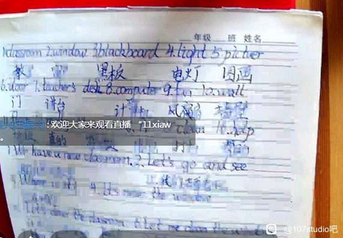

# 107抽象人物志：田师

## 1 田师的简要介绍

> 田振兴，2006年河南大学数学与应用数学专业毕业，2006年参与数学竞赛辅导和授课，2008年任数学竞赛专职教师。从教以来，有十多名学生获得全国高中数学联赛一等奖，两人获数学冬令营铜牌。[^1]

但是，从来如此，便对吗？

> 笔走又龙蛇，“葱”字见于前。台下何欢乐，台上何茫然。茅塞而不通，田师声暂绝。忽而伸长手，径向黑板前。霎时葱字销，歉意脸上现。同学悉明朗，附和振兴田。——《 迎田归 》
>
> 几何画板妙，田师视如宝。课前无准备，课上复现造。——《五律和博士·画板》
>
> 回首济南培训间，面色憔悴儿猖狂。直教手机无电量，欲哭无泪田师样。欲言家长从何往，手边习题心中茫。杏儿虽红独滥觞，黑白红杏孰色盲？——《田某济南打油歌》
>
> 数论代数蒙混过，似把田师嘴巴封。不知说话为何物，应是神游物外中。——《田师新赋》[^2]

但是，这就是所有了吗？

> 某些田师的介绍：[对一中数学竞赛老师有看法的进！！！！！！！！【安阳一中吧】_百度贴吧 (baidu.com)](https://tieba.baidu.com/p/738761989)[^3]
>

## 2 “难懂”的定理

故事要从2021年3月开始讲起......作者和很多同学在当时一起上了田师的贼船。这样一个拥有着60岁面容的40岁数学老师，说实话，给本鼠留下的第一印象还不错：貌似挺有学问的。谁知道捏，第一节课本鼠就明白了：他就是依托史。

第一次课：证明平行线分线段成比例定理。一个九年级的定理，这个b用一节课的时间来证明，最后自己搞晕了，直接证伪了……望着这一沓讲义，鼠鼠第一次感受到了数学的乐趣——看别人出丑——不过只是一个衍生乐趣罢了，真正的乐趣？等着吧……

> 可能有的人要问了：什么是平行线分线段成比例定理呢？
>
> 平行线分线段成比例定理指的是两条直线被一组平行线（不少于3条）所截，截得的对应线段的长度成比例。推论：平行于三角形一边的直线，截其他两边（或两边延长线）所得的对应线段成比例。[^4]
>

一刻也没有为证不出平行线分线段成比例定理而感到哀悼，立刻感到战场的是——定差幂线定理、张角地理（对，就是地理）！不出所料，田师又是不会证。

在听田师上课的时候，我在想：Rapper也会用超快语速说出一些晦涩难懂的内容，田师也不例外；他们还有一些相似之处，如：令人担忧的素养和夸张的举止。

## 3 春天的召唤

2021年4~5月。此时，田师抽象的能力虽未曾下降，但是另一股更为抽象的势力在校园东南一隅缓缓壮大。为了对抗几股抽象势力的联合进攻，作者和吧主、指导、犇、龙哥等人创立了107工作室并成为其中的老东西。吧主在田师课上开始创作了一系列有关蔡师的诗篇——《Hop-凤君不要》《凤君赋》，开创了在田师课上创造的先河。

这同时也为6月第一次大革命失败埋下了伏笔。

至于田师在这一阶段的抽象事迹，大抵也就是吹自己的水和口齿不清的讲题以及用那一双帕金森的手操纵着几何画板吧。总的说来，就是下面几件事情吧。

2021年4月，田师因为考场布置、桌椅摆放、上课时间不明与领导争论而被校领导训斥。

2021年5月，田师回忆了自己的出初高中时代。田师在初中时，几乎所有老师因为琐事而停止教学。虽然田师是数学老师，但是他高中的时候物理非常的好。田师回忆到自己高中参加物理竞赛时，因对光学内容掌握不全而十分懊悔……

您老慢慢回忆就好了，底下的同学们就是看你的乐子的。

田师于2021年5月在课上讲解有关经济、复利的内容。经典名言：“我每天看报。我自己订的报纸，我天天看。拜登上台后大量发行货币，全球资本都在找寻新的落脚点，想生利。”“对乘方有敬畏之心、对乘方要有基本的概念……”“你们能活365个月吗？”

当时我可谓是”火力全开“，直接把田师10分钟之内说的所有东西基本上全部记录了下来，并为之后回顾相关的内容提供了第一手资料。

## 4 《振兴李炜赋》

2021年6月。书接上回：田师在2021年中考期间仍组织大家上锑一般的数竞课。仍记得那是一个闷热、冗长的下午，兲史在用蚊子嗡嗡一般的声音进行讲课。一切都是睡觉最好的催化剂。

但是，吧主整的活永远不会让我失望。本鼠和吧主光哥有幸坐在了一起，并于当天创造出了有关兲史的最伟大的作品——《振兴李炜赋》。

> ### 振兴李炜赋
>
> 近平八年，风调雨顺，国泰民安，能人异士，纷纷涌现。上有只身复古蔡红楼，下有十年隐忍陈先锋。此暂且不提。今又有二能人，其一能斗酒千杯，醉中笑骂天下事；其二能忆苦思甜，犬吠怒斥校领导。吾及吾友博士因为长诗，凡五百三十二言，命曰《振兴李炜赋》，亦增笑予尔。
>
> 遥望寒武草履虫，似是炜师寄其中。身负大材不堪用，酒后真言不由衷。
>
> 几何画板真名世，键仙田师翩翩至。愤愤闷闷被训斥，郁郁沉沉不得志。
>
> 二者本是天上仙，念动凡心坠人间。投身教育甘清贫，怎料磨难度流年？
>
> 孤高忠勇直进谏，高考造假河南先。初中试题高招现，竞赛名额在手边。
>
> 自古文客具傲骨，炜师赚钱真辛苦。可怜酒精迷幻梦，手镯如银链如柱。
>
> 电网高墙枯死树，缘起一张判决书。炜师教训犹在耳，独觅斯人幽暗处。
>
> 炜师获刑罪被判，心似刀绞魂如断。可怜炜师生涯路，荣誉自由分两半。
>
> 物竞崩塌领导慌，数竞只身寄众望。大厦将倾狂澜起，田师一力扛工荒。
>
> 振兴中华为己任，奈何无人把理陈。中学老师四散逃，空留光学万古恨。
>
> **夙兴夜寐日操劳，无奈病根身上落。咳咳呵哈咳啊呸，命如残灯无可靠！**
>
> 博学多才涉猎广，经济领域无冕皇。全球资本找落脚，只因拜登美帝狂。
>
> 心忧股市一片绿，只身潇洒茅台去。怎堪乘方无概念？却把公式谬论叙。
>
> 缘起不因情之深，缘落如风了无恨。幻梦一场大彻悟，数竞与我从此分！
>
> 阴阳本自两相隔，田师为主吾为客。阳间田师万人捧，阴间我等无人喝。
>
> 仙道精纯无人传，吾亦愚笨不可担。一别终年不相见，吾独自由度华年。
>
> 安阳一中处何位？竞赛二师言有晦。勇夺学涛物理冠，怒斥领导无作为。
>
> 蛟龙怎堪居浊水，猛虎何苦隐荒山？二仙法力既通天，怎陷一中不可退！
>
> 一中偏远地荒芜，二位名师不可住。一已成仙化风去，二留孤影独徘徊。
>
> 二师身劳苦功高，惜怜人才?日渐少。愿师终能归其所，不枉流年吾空耗！

本鼠和光哥在切磋、琢磨，那个史一般的下午正逐渐的有趣起来。突然，光哥写了一句：

> “夙兴夜寐日操劳，无奈病根身上落。咳咳呵哈咳啊呸，命如残灯无可靠！”

这句话一出，直接给本鼠和光哥都整的绷不住了，直到下午放学都一直在笑。一想到田师那张老脸和咳痰声，两人就是低头，捂嘴、掐肉以转移笑容。可惜的是，田师的笑转移到了整个班上的同学们，包括我俩……

下课时，田师开始了经典的犯病环节：“两个大男人，也不说话，不知道在纸上写些什么东西，写完之后看一看笑笑，我最看不起你们这种人！”不过，大抵是那一天有太多人不好好听课罢，居然还有某同学课下找到我，说，我还以为田师在说我们两个……

## 5 高一田师加试

2021年7月。2021年6月30日，田师那摊大脑发育不完全，小脑完全不发育的脑子不知道是哪两个神经元启动了，连上了，准备要给我们加一场数学考试。这个b联合wb先是把我们的东西全部收上去再开始考试，考试过程中还一直翻大家的笔记。我依稀记得老子的生物作业还夹带在里面捏……田师出的有多难恐怕只有自己才知道了罢。事后，我才得知，光哥的整活语录也在里面，可惜里面没有写田师是金属锑就是了。

7月3日，田师止不住地爆典：“这题目逼着你想线性规划，这些都是你学过的东西，除非你上课不听讲！”“你说这个题目难吗？要么就是你平常做的题目太难，傻难！”

每每有人想与田师争辩，田师便涨红了脸，额上的青筋条条绽出，争辩道，“你们初中没有学？上课我没有讲？”接连便是难懂的话，什么“傻难”，什么“就这水平”之类，引得众人都哄笑起来：教室内外充满了快活的空气 。 ”

当然，这不是他全部的目的。他真正的目的是~~**来吃回扣**~~给同学们一个提升自己的机会的。田师介绍了去济南培训的相关内容。鼠鼠不想去就没报名捏~

## 6 用快充，不停抽（象）

2021年8月。田师在线上和线下都展现出了自己的独特抽象能力。

2021年8月1日，田师在正一中学线下上课。放假回来的第一天，大家是什么样的就不用我多说什么了吧。田师依旧是蚊子讲课法，讲的大家昏昏沉沉。本鼠实在是没活整了，老老实实地听了一天课……

第二天开始线上教学，本鼠和光哥（主要是光哥）开发C++写成的田师模拟器V1.0。田师模拟器的灵感取决于田师在网课期间展现出来的惊人的抽象能力，如：上课洗澡等。在开发进行的时候，鼠鼠从来没有想到，在拥有99万城区人口的某某市，自己与田师的直线距离不超过200m……

本鼠在上课的过程中，时不时地能听到救护车的声音。耳机内外同时响起救护车的声音，让本鼠感到很是诧异。没过多久，2021年高联开始报名，当看到报名表的投寄地址，本鼠知道，线下单杀田师的机会来了。那一坨脱毛不干净的肉仍在我们小区门前摊着，那一个上午让晴朗的夏日多了一丝阴霾。

上面是和另外的一个鼠鼠的聊天记录。话说回来。田师在这一阶段抽象的具体内容是：用洗澡声当背景板；左手边放答案右手将答案搬到屏幕里面；在公屏下看报；用自己不知道**搁哪拾嘞**荣誉证书当垫板和重中之重——蚏蝶定理。

## 7 蚏蝶定理

8月3日，数竞省一的z同学率先发现了田师的”错误定理“，并po到了班级群里。BY率先发现了蚏这个字的奥秘之处，而杰哥独树一帜，揭示了该定理在文学方面的应用。

> 有个女记者曾问我，是什么缘由让你这样喜欢和那些昆虫们生活在一起的？我并没有很认真的回答她，反正也没人会去关心这些。不过缘由还是有的。看完《燕尾蝶》的那个晚上，我做了一个梦，我的梦即如同我现在所看到的一切。我梦到了一只我从没有见过的蝶。我从未曾见过这样的蝴蝶，我想说出她的名字，但我根本不知道她叫什么。她是一种会散发出璀璨光芒的蝶，在无尽的黑暗之中所闪烁的光。她更像是精灵。
>
> 玥蝶玥蝶玥蝶玥蝶玥蝶玥蝶玥蝶玥蝶玥蝶玥蝶玥蝶玥蝶玥蝶玥蝶玥蝶玥蝶玥蝶……惊醒之后，我脑子中不断重复着这个词。为什么会是这个名字？或许是她在梦里告诉我的，或许不是。我躲进图书馆想查找关于她的资料，属于凤蝶科还是灰蝶科，是森林蝶还是沼泽蝶？有个叫“伊莎贝拉”的稀有品种和她很像，那是全欧洲甚至是全世界最美丽最罕见的蝴蝶。我一度认为我看到的就是“伊莎贝拉”，但后来在蝴蝶交流会上看到了这个品种，不是，它很普通。
>
> 相对而言，玥蝶可能只是我幻想出来的的产物。可我却从未怀疑过她存在的真实性。我相信她一定在这个世界的某个角落在等着我，而我所要做的只不过是，一直寻找她而已。于是多年之后，我以一名动物学家的身份，踏上了寻找传说之蝶的旅途。[^6]

## 8 备战2021高联！咦？人捏

2021年9月。田师人间蒸发了，只留下了38页的数列题。

有文章为证：

> 秋分时节，天高气爽。吾独欣然流连此景之中。然天降二奇兵，手执所谓“圣诏”曰：“十月初六，完资料书，足有三十八页。”又言：“下周四，通查全班也。”
>
> 此诏一出，全班哗然，纷纷吵吵，有如勾栏。上有指导言曰：“田师岂不梦乎？”下有博士接曰：“恐已与炜师隔窗同乐，共品秋茗，赏明月哉！”众皆笑。吾以为田师梦中不醒，胡言乱语耳。欲问何出此言，有三大据为证……

2021年10月。数竞考试就要来了。至少在高二那年，看起来他像放弃我们了一样，其实第一年的考试最抽象的不是田师，而是宇哥他爸（回头开将军帖细🔒）。大致内容是我们包车去了，包车回来了，然后就没有然后了。

是不是以为田师没活了？我不认为。

> “谁终将声震人间，必长久深自缄默；谁终将点燃闪电，必长久如云漂泊。”
>
> 
 ——尼采

## 9 “猛日葱 ”

沉寂两周之后，这个人老珠黄的b东西，以一种全新的姿态出现在了大家的面前。

> 身著绿夹衣，气定有容颜。
>
> 
 ——《迎田归》

他带着他的蒙日定理过来了。他首先对着大家一顿输出，认为大家都多大了还找不到座位。紧接着，说这“不是学生的过错。这么大的行政楼，都是鬼屋”之类的话语。

他乐意讲，大家自然也是乐意听的。这一次，教室里又充满了快活的空气。

终于田师的犊子扯完了，开始讲蒙日定理了。开幕雷击，或者说，开屏暴击。他首先以一种非常奇怪的发音开始，要把“蒙日”发成“猛日”；又笔走龙蛇地写下了“大葱”的“葱”这个字。

此时，教室的气氛极其诡异：大家脸上的笑容明显多了起来。

有些人，注意是有些人（比如吧主）甚至直接绷不住了。😀

不过有些人还是能绷住的。🤓

本鼠一眼丁真：他这个熊样，肯定是维生素摄入过少导致的。所以他把“蒙”写成了“葱”也是情有可原的。这样，他可以弥补他那心中所想的维生素。

Ps:值得注意的是，蒙日定理是我们考试的内容。所以在考试之后讲考点的老师，他算第1个。

值得注意的是，2021年10月19日的猛日葱事变，是107工作室创作的高峰时期。这一时期，我们工作室正在扩大规模，招募了一批优秀人才。

下面是我和吧主（酸菜鱼）的吐槽：

## 10 数学课？文学课！

2021年11月。田师在2021高联属实是赢麻了，不仅有很多的一等奖，也有数不清的二、三等奖......

杜牧说过：“独夫之心，日益骄固。戍卒叫，函谷举，楚人一炬，可怜焦土！”田师肯定是飘了罢，之后明显不好好教书了。送走了平面几何之后，我们迎来的是——不等式。

不得不说，不等式是人类数学史上的一个伟大发明。不等式贯穿着人类的发展：从三角不等式、Cauchy-Schwarz不等式到Jensen不等式、Holder不等式，再到21世纪的唐妞不等式，虽然形式一直在改变，但是，它解释世界这一属性却没有变。比如说：接受礼物≠我同意 之类的。

2021年11月。田师最近是迷上看报了，它每次上课都会拿出新鲜出炉的《南方周末》仔细品鉴一番。😀可能，中年男士的魅力大抵就在这里吧。但是，田师是行将就木的老年人士。某一次上课，田师就像被附魔了一样，直接开问大家写文章的事情。它鼓励大家写文章向报社投稿，指导老师写成自己的，这样还能~~**赚一笔稿费**~~让自己灵活就业。兲史又回忆起来了自己以前高中同学创作的文章：《大戏台子四方方》。但是兲史仿正在给人寇一般，嘴里含糊不清的说着话……f同学在下课后主动找田师探讨问题，并问到了田师所说的那篇文章。再次感谢f同学！现在请大家欣赏片段：

> 大戏台子四方方
>
> 镇上的“鼓吹台”（我们这里土话叫“戏楼”，跟北京城长春宫的戏园子可没得比）就在我家老屋后头，只隔方鱼塘，是花砖墁地、大青石砌的一个方方正正的大台子。赶上逛庙会，家家户户凑个份子，去外地请个吹唱班子或戏团，就上这儿来敲敲打打热闹十天半个月，大家伙儿不就图个乐儿吗？也让那些整日里满衣裳粥嘎巴儿的小儿听个响儿。
>
> ……
>
> 
>
> 二奶奶说过几年再说吧，她娘家还有个老哥的大儿子是个唱京戏的，等我再长几年，她就把我托付给他，“等你成了角儿，甭忘了你二奶奶就成。”二奶奶敞着怀，两个奶子当年被我吃干了。“不会的。”我伸手去摸奶穗儿，被她的荷叶扇打了回来。
>
> ……
>
> 
>
> Ps.这篇文章是三精杯全国中学生作文大赛第三赛季（2000年）一等奖获奖篇目。文章被数竞教师田师评为“土生土长的汤阴人写出了很有京味的文章。”

此时田师讲课的水平已经烂出了新境界了：摆烂式的念答案、不讲解、下课就看报或者看数学女孩……

于此同时，我们的文学创作更是达到了新的高峰了：光哥在兲史课上写下了宏篇巨作——《立鹏程之志，承时代之运，守自身之德》，获得了蔡师的高度评价——“非常好，我决定在班级展读！”

下面，我们来欣赏一下罢：

> 成功之路，究竟在何方？古往今来，多少仁人志士寻找施展宏图、一展抱负的机会，却终身遗憾；多少豪强官吏沉醉犬马声色、纸醉金迷，最终玩火自焚；又有多少庸人目光短浅，不立长志，庸庸碌碌一生？由此视之：成功之难，难于上青天！
>
> 然而正如格言所说：“没有登不上的山，没有走不完的路。”先贤曾指示我们：要处理好“志”“运”“德”之间的关系，才有望登上人生的高峰，品味成功的滋味。
>
> 有志不在年高，无志空活百岁。立鹏程之志，是通往成功的钥匙。
>
> ……

## 11 New Year 2022

2021年12月21日：冬至，包~饺~砸！兲史作为特邀嘉宾到了现场。说实话，兲史和zyj的猪头肉太泥码肥了，没人吃（乐）

2021年12月31日：元旦晚会。兲史作为特邀嘉宾又一次出现了，只不过，是被挂到黑板上了（再次乐）

2022年1月8日，在兲史课上，大家得知了放假的消息。

几天之后，田师的**琴声不等式**正式开讲，这是吧主最后一次听田师讲课了（虽然之前也没听多少罢）

以下的故事，将变为我和f同学、b同学、l同学为主要人物了。

这里，需要附上一点照片了。田师可能是太老了罢，老到连几点上课都忘记了罢。附点照片。

> （👌👌👌👌👌👌👌👌👌👌👌👌👌👌👌👌👌👌）

## 12 又一个春天

2022年。真是一个奇幻的年份啊。寒假里，宇哥持续的癫狂，这个回来我们再开贴细。3月。阳光和煦，正好是充电的好时机。田师直言自己在寒假学习到了不少东西，如：UVW Method、英语（用来翻译英语文献）、红楼梦全本等。

注意到宇哥听的那叫一个认真啊，可能自己也在看罢。哦，对了，你的那是“青楼梦”罢。

2022年4月、5月：疫情愈发严重，田师整活全被少尉和赵yj等人的锋芒盖过去了，不说了

6月、7月：没活

2022年6月：鼠鼠在黄河大道做核算时偶遇了田师捏，没想到，以后偶遇他是个常态......

## 13 备战2022高联（算是吧）

2022年8月：最抽象的一段来了。

### 第一集：赛博田师篇

大抵田师是年龄大了罢，或者是天天想着如何赚外快罢，田师体力不如以前了。要知道，田师以前可是很能喝的。曾经田师就和f同学的父亲一起喝酒说回正题。田师上课的时候明显力不从心了：之前还是能讲一晚上的，后来什么都不讲了，全靠悟。也难怪这b头发这么少，是不是以前皈依佛门过啊？田师不讲的时候，就坐着；或者去高二15班的前窗户上坐着，一手扶着密码柜顶部。我们根据这一抽象的动作，将其命名为CyberTS. 不锈钢的柜顶估计有地线，而辟谷里我们则则猜测有一火一零。

有一次，田师想证明不等式，搞了半天没有弄开，此时，一哥们使用切比雪夫不等式轻松化解问题。田师在一旁“充着电”，大气都不敢出。我们几人快笑嘻了。

### 第二集：舔舐与菊花的爱恨情仇

上面提到，田师经常咳嗽。久而久之，大家已经免疫了。然而，这一次的咳嗽直接到达了高超。某天21时许，田师正在讲那该死的升幂定理，本鼠和大部分鼠鼠都不会捏，只好抄他抄的笔记。突然，田师消失了。紧接着，外面水房传出来一声巨响。

据龙哥讲述，田师和水的时候，不小心把水中的菊花卡在嗓子里了......田师的脸直接红温了

大家自然就是一声声的爆笑咯~

### 第三集：高效的时间管理

众所周知，集训的文科楼离3号楼确实有一定的距离。所以，那里就是我们的天堂捏。不过，像西游记里那样，天上确实有弼马温捏。某雌性🐷隔三差五的会来这边转一圈。同时，田师也会不定期巡逻。大家在游击战中获得了某些经验，时间管理一定算一个。

具体来说，大家逐渐摸索出了一套规律：田师在文科楼办公室的时候，会打开灯；离开的时候，则会关上。当余光觉察到灯光关闭时，大家收起自己的杂物，“专心”地学习起来。

> 大家不要学他们几个上课看闲书捏，有好几次都差点被zyj抓到。鼠鼠眼疾手快，提醒了好几次。

既然教室有多媒体，那我们是否可以使用捏？你的田师也考虑到了。他早些时候在下载报名表Excel的时候，就在那台电脑上登陆了自己的账号，**还贴心地保留了密码。**
从此之后，6：30-7：10，等田师离开后，大家就用田师的遗产看b站。那段时间，鸡哥二次火了起来，大家一起模仿鸡哥跳舞，好不热闹。

我也没有浪费好机会。我曾经用田师的键鼠和账号登陆了一次107studio的网站。仍记得当时田师使用时屏幕上留下的浏览记录。😆😆😆另外，我也把WB老师的毕设拷贝了下来捏。🤣🤣（写的依托答辩）

为了防止搞偷袭，我们会讲数竞教室的窗帘悉数拉上，快到点时，一个人关电脑，一群人拉开窗帘。直到有一天，没有人拉窗帘，被舔舐训斥了一顿：“不是你们怎么回事，怎么把窗帘拉上啊？”

还是鼠鼠和f同学机智，把它们及时的拉开了。

### 第四集：读书人的事，怎么能叫窃？那叫化归！

还记得小办公室吗？为什么天使要去？well，还是来看看近处的讲台吧家人们。某次下课，我和BY在讲台说话。突然发现一摞打印出来的讲义，上面全是习题和答案。是的，甜食直接念上面的内容，连一个下标都不带改的。鼠鼠说：如果给他拿走会怎样？大家哄堂大笑起来；教室里又一次充满了快乐的空气。

当然，这不能否认天使没有成就的。只是现在，廉颇老矣，饭？吃卸忑吧！

不过，让我们的田师动起来，只是缺少一点催化剂。而我们的LB同学，就是这样一个催化剂。

记得某一次LB突然举手，想针对问题进行提问/发出自己的见解。LB：“你这定理有问题啊！”

一众同学：“没没没没没问题，我写错了，你自己改一下”😂😂

ts突然开窍，顺着他们的话茬就说下去了。

而我们的lb呢？站着，听完了。

### 第五集：搬迁

新的学年，我们也要搬到古战场了。ts让大家过来扫地。不知道其他人去了没，我反正是没去捏拿完东西就陪儿子们打球去了。结果捏，你舔史急了，又开始爆点了（你这b挺会红温啊）：“我们是一个集体，那么，为什么有人不值日啊？凭 什 么 啊 ？”

注：2022年8月30日，数竞上课地点恢复到原数竞教室。田师强调所有人必须到高二15班打扫卫生，但是没有人去。田师因为此事件而生气。

后来，这件事随着当天争客装闭和食堂停火不了了之。（装什么？装汇报啊！）

田师在原来的抽屉里发现了三角牌，上面写着“监督员”。他每一次坐在讲台前，总要先调整它的朝向，仿佛这就是他姥亩的顾辉何，不能受到一丝亵渎！

那时，日子过的既慢又快。这段时光可能是鼠鼠高中三年最美好的时光了：没有繁重的课业压力，每天和BYD们一同进步，一同找乐子……当阳光照在书桌上，照在地面上，照在那一张张专注的脸庞上，也许，这就是青春吧。

## 14 中秋节、教师节、高联

22年的高联，依然不甚平淡。出发去一星期，报的车无法出城，考点疑似要7天在低风险地区的证明。物理竞赛的一定有印象罢数学竞赛就是在赌一个能够考试的机会。与大家自驾或拼车不同，鼠鼠和lb坐高铁去的（其实去郑州，2人，火车是最划算的选择）。考虑到普速列车不太安全，鼠鼠特意选择了管内高铁线。

当天早上，ts一如既往地让别人捎带他。ts先坐l同学家的车到郑州，又坐f同学家的车回安阳。🤮ts大约在10时许到了郑州，逆码到了就要吃，这真是猪-猡！他们10多号人选了个信阳餐馆，花了1k+。鼠鼠自然没去咯~鼠鼠在候车室给他们打电话怒斥ts，爽到爆炸！

p.s.田师当天上午在省博物院参观捏。

> 家长评论：孩子们过了一个难忘的中秋节+教师节！

下午，鼠鼠到了，鼠鼠，lb，lby三人猜拳谁去问天使问题，鼠鼠输了捏嫲嫲的！到了那个房间我就发现两个人，田师和另一名男子。鼠鼠的问题泰国弱智，被骂了捏。

田师当天没有什么表示是最不能理解的，这可是鼠鼠们在外地过的第一个中秋节啊！

考试当天，上午玩韭菜天使（钢琴块）并拿到了pb；

下午就回家了。数竞生活结束了。

其实，写完这个贴总有怅然若失的感觉。在这里，我先谢谢一下田师，是你让我们收获了更加坚韧的友情。我还要谢谢那些帮助我的人。在最后，更要谢谢自己，希望每一次回忆起的时候，脸上总要带着甜甜的笑容吧，尽管，它们已经离我愈来愈远，愈发不清晰了。

欲买桂花同载酒，终不似，少年游。

---

> 1. [田振兴 (ayyz.cn)](http://www.ayyz.cn/overview/laoshijierikuaile/2018-09-10/1489.html)
> 2. [文章全集](../dedication/total.md)
> 3. [对一中数学竞赛老师有看法的进！！！！！！！！【安阳一中吧】_百度贴吧 (baidu.com)](https://tieba.baidu.com/p/738761989)
> 4. [平行线分线段成比例定理_百度百科 (baidu.com)](https://baike.baidu.com/item/平行线分线段成比例定理/4166123)
> 5. [振兴李炜赋 | 107Studio (a107studio.github.io)](https://a107studio.github.io/docs/article/total.html#振兴李炜赋)
> 6. [玥蝶 - 简书 (jianshu.com)](https://www.jianshu.com/p/a7ded48d4dd6)
