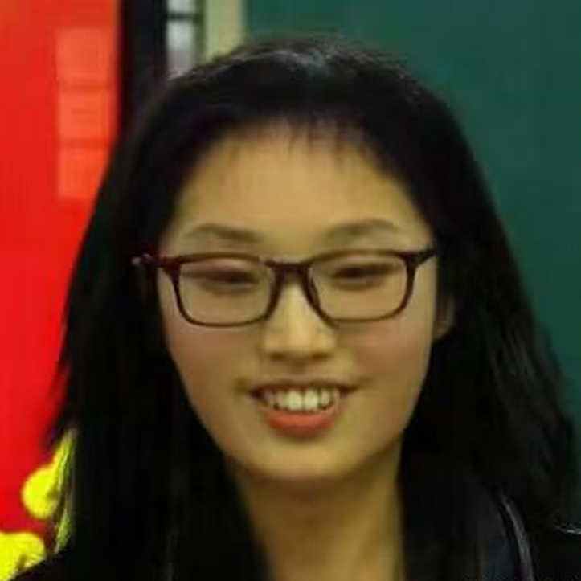
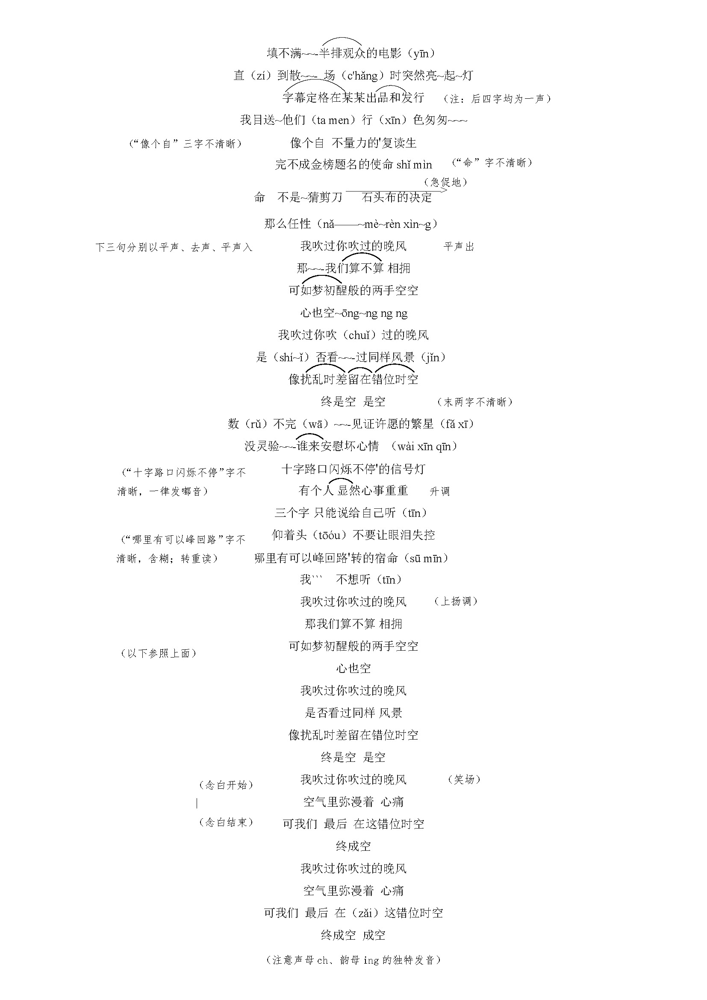
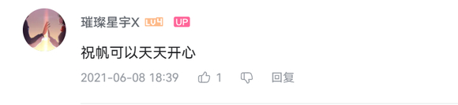
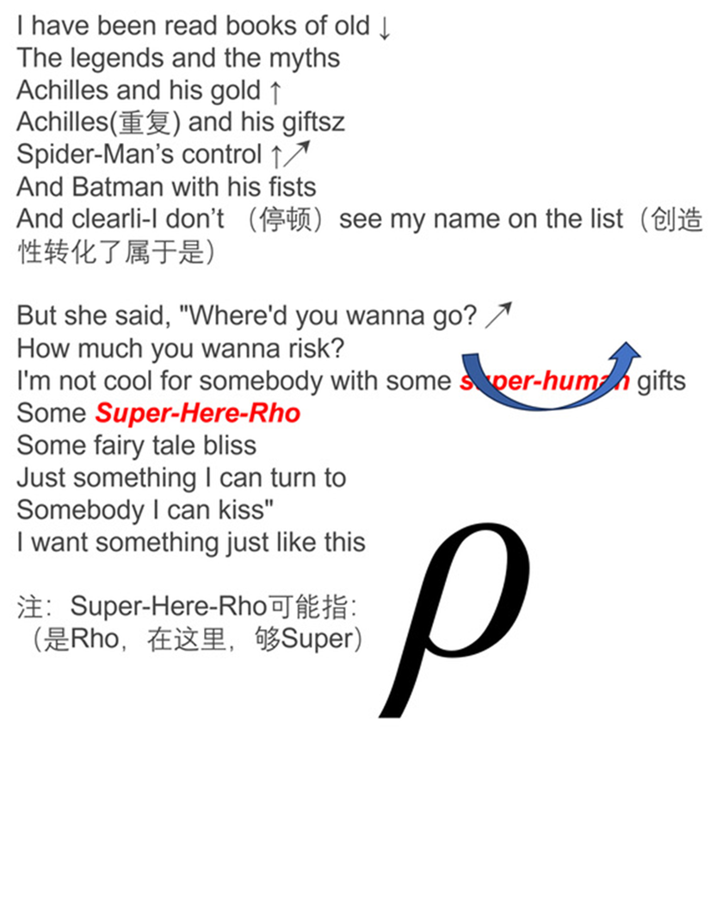

# 107抽象人物志：将军

[回主页](./index.md)

前情提要：作者和文章里面的同学们都来自于华北平原的某小城市，面对考试升学的压力是非常大的。在极端的环境下，大家都会变得不正常，有些异化了。而某一些人自然会先变得不正常起来，他们就会变成大家的谈资。有些人甘愿做这样一种快乐的催化剂，而有一些人则是异化到让大家都讨厌的地步。以下便是其中之一。作者提醒：关于人物的所作所为，不能孤立地、武断地看待，而要有联系地、客观地、发展地看，并请理解在生命安全缺乏系统保障，人生前途愈来愈不明朗，社会压力愈来愈大的情况下的某些举动。也许这些东西在当时为大家所不解，但是，我们只讲述故事情节本身，至于如何解决某些让人异化的问题，或许就不是一个人、一小群人能够做到的了。

 

作者注：本文中人物均为化名。

人物介绍：

将军（主人公）

以下为男同志：

小绿、BY（主人公的初高中同班同学）

作者本人、指导、高鼠、牛、鲟、班长、CY（和主人公初中同校，高中同班）

酸菜鱼、龙哥、佩奇、冯神、YF、XH、QH、DS、JS、YX、KY、RS（主人公的高中同班同学）

以下为女同志：

S同学（主人公的初高中同班同学）

W同学（和主人公初中同校，高中同班）

D同学、C同学、L同学、Q同学、X同学（主人公的高中同班同学）

 

老样子，正主镇楼。

为保证帖子的安全性，本人决定隐去真实姓名。 将军，本名**__**，字ycy，号：璀璨星宇、超帅闫大哥、宇哥、General、钪(Sc)、正义使者、摧残性欲、鲶鱼、猥缩男、似肥猪（按照称呼的攻击力由小到大排列）。下面我们先来简要介绍一下各种外号的由来。

## 1 外号的由来

外号的第一条和第二条为将军自己取的。“璀璨星宇”的意思是希望自己能像星星一样闪耀在满天星空上，成为比较成功的、耀眼的人；而超帅闫大哥则为他曾经的b站账号名，反应了宇哥的英俊和潇洒，就像镇楼图一样。外号的第三个是大家面对宇哥的官方称呼，在这里，大家对宇哥保持着最后的尊重。如果说上面这一个是大家在与宇哥交流的所使用的称谓，那么外号的第四条则是我们私下对宇哥的敬称。东北全明星中有一个叫王志宇的，他以各种逆天整活而扬名四海，因而被封为“宇将军”。碰巧，宇哥的名字中也带这么一个“宇”字，所以，他也就顺理成章的被称作“宇将军”。

关于钪的称号，则是由我们班级的女同志们所封的。知周所众，钪是第21号元素，而第22、23号元素分别是金属钛、钒。女同志们使用这两个金属的谐音“太烦”来指代宇哥，并使用钪作为“指针”，指向“太烦”这一个地址。（学编程学的）“正义使者”则是由BY创造的，我们之后会详细讲述该事件。

下一个称号则是璀璨星宇的讹传。不过，在8u们的创造性转化、创新性发展下，他也被赋予了一些新的意义。具体来说，总是又一些逆天的8u会往群里扔各种宇哥的鬼图，包括但不限于女版宇哥等。每每看到这些，群友们就会发给绿巨人寇的表情（其实捏，应该给我），想必这些图片们一定摧残了大家的性欲了罢。“鲇鱼/鲶鱼”的称号则来源于指导大人。当时宇哥在我们楼下住，每每说到这该死的b人，指导就会让大家去想象宇哥在底下赤石的样子。于是乎，这个称号也逐渐代指宇哥了。猥琐男和死肥猪则是共识，不用我再说什么了罢。

关于死肥猪的事情，最近又有新的补档，此处感谢牛子。他考古到了宇哥在上小学四年级的时候写的文章，题目是“读《牧羊猪》有感”。在文章中，宇哥夸赞了这头小猪的超能力。龙哥在底下留言道：“贝贝者，死肥猪也，将军自称尔。羊群者，将军臆想之众女也。其欲当妇女之友之心，自小可鉴尔。”将军与猪的结缘，现在开始。如果说，小猪贝贝是将军的小时候的话，那现在，也早就该成为老肥猪，甚至死肥猪了罢。

## 2 小学到初中

现在开始讲述宇哥的生平。宇哥与2017年从W小学毕业后，就进入到+1中学就读初中，而后就与本人成为了高中同班同学。在这里，鼠鼠对小绿、BY同学的遭遇表示同情——因为它们二位和这人做了六年的同学。将军小学阶段的内容，本人不甚了解，遂跳过。初中阶段的内容，鼠鼠只是略知一二，所以，这里还是请上面的两位受害者来讲述罢。

> 小绿: 本🐭初中竟不知此人本性
>
> 作者回复：我也不知道
>
> KQ: 第一次碰见将军应该是在小学5/6年级，当时我还是觉得将军是一个非常厉害的人
>

BY（General的初高中同学）：补档：将军本人在初一时期极其抽象，本鼠当时只懂得麻麻说的找好学生玩，所以在初一跟将军走的很近，有次我和将军之间隔着一名女生（我的同桌，鼠鼠本人初中时基本上都和女生同桌，可上了高中后就没这种待遇了，连前后桌都没有女生）将军当时总是找这名女生聊天，再加上这名女生思想比较开放，网上冲浪较多，懂很多小朋友不懂的内容（当时鼠鼠本人就不知道他们说的什么），突然有一天我的同桌气呼呼的把将军告了，后来询问内情，原来是这死猪给那名女生说：“我想屮某某（那名女生妈妈的名字）”我便想，这土木是什么出生玩意，以后万万不能与其来往了。（离离原上谱了属于是）

BY（General的初高中同学）：再补档：初中学校体量较小，没有专门的宿舍，所以大家都将就着在教室趴着睡，将军一般都是一打午休铃就睡，鼠鼠很菜，所以要学一中午才能写完成山的作业，但鼠鼠在和将军挨着后找到了一种好玩的玩意，就是将军闭眼后一两分钟会立马波奇，这时鼠鼠就偷偷拿小指头夹将军的小豆芽，这小东西是真的小，感觉比LB的都要小，而且是硬硬的，大概将军每次都会用意淫来使自己在香甜的春意中入睡吧。

> YF：下次🦌🦌我的
>
> 小绿：逆天，咋不让我玩
>

## 3 高中前两年

进入高中的时候，由于本人对宇哥不甚了解，所以，完全把他当作一个新同学来认识。首先就是宇哥极其强大的自律能力。宇哥在高一上学期的时候总是选择在宿舍自习。每一次中午，住在他隔壁的本鼠总是能看到605房间内的宇哥正在专注地写着自己的作业。这一优秀的素质也被班主任关注到了。他曾经有一次给同学酸菜鱼说：“你应该向ycy同学学习。我认为他可是咱班男生的领头羊啊！”当时，这句话在酸菜鱼同学心中留下了深刻的印象。

酸菜鱼：补档 不是给本鼠说的，而是本鼠被叫到办公室批评了（具体什么事忘了，恰好听到班主任对将军说：ycy，你知不知道咱班男生都把你当做领头羊，你要发挥好带头作用等等废话。当时鼠鼠比较敬佩宇哥，但是觉得“领头羊”有点过了，毕竟班里还有其他人，于是印象就比较深。

另一个有关自律的内容，就是自习了。我回想起了高一下学期的故事。那时，宇哥在404房间。一到中午，404房间就异常的安静，安静到就算宇哥偷偷打个胶都能听见。宇哥自己一个人在404学习，至于其他人？Not Found了。

还有一个有关自律的内容，就是禁欲了，宇哥在高一上期就对同寝室的鼠鼠们说自己已经有200多天没有弄过了。大家作为新生，对各位的认识也不甚全面，所以就在心中默认了宇哥的纪录。他估计是当时没有能力了罢，才200多天没有大叫的。

果然，回旋镖是最有力的打脸证明。有关一日三次的内容，我们随后更新。

 

高一、高二的内容，本鼠在当时也不甚了解。所以，为了保持故事的可读性和本人视角的真实性，我们的叙述手法可能会不定时改变，叙述视角也不定时更新。

在高一和高二阶段，他给我留下的印象，即相似又不同。他热衷于足球，所以自然在学校举办的足球联赛中，他就报了名，成为了班级联队的一员。（虽然最后没有几次上场就是了）除此之外，他对音乐也颇有自己的见解。他不落窠臼，潜心钻研，终于研发出了自己那一套独特的唱法。他作为受邀嘉宾在高一和高二的元旦晚会上分别表演了歌曲《最初的梦想》和《孤勇者》，以自己的硬实力征（唱）服（跪）了在场的每一名观众。

> LB：正可谓：绿茵场足底锋芒初露 晚会中歌喉石破天惊
>

本人在高一下学期上数学课的时候偶然得知宇哥有一个b站账号（uid：631651838）（作者注：已注销）。他经常会往上面上传自己的数学心得和讲题内容，可当时我并没有理会。后来我又在高二偶然得知他还有一个全民K歌的账号。很多人向我推荐他的歌唱技术，说“如听仙乐耳暂明”。怀着试一试的态度，我下载了全民k歌，并注册了一个账号。当我正襟危坐地开始听宇哥唱歌的时候，我才知道：这一切都晚了。那一首错位时空真的是“此曲只应天上有，人间能得几回闻”啊！他那含糊不清的嗓音，配合上无边无尽的夜晚，听了之后令人毛骨悚然。就像堵塞的下水道绽放出了绚丽的棕色的花朵，就像蚊子和苍蝇们在谱写一曲动人的乐章。

当天晚上本鼠直接没有绷住，连夜赶制了第一版错位时空的歌唱教学文档。等到第2天上体育课之前，鼠鼠把该文档掏出来并向其他鼠鼠们分享。当其他人听到本鼠控诉自己的耳朵被雷普的时候，他们却让鼠鼠慢慢听——还有更多的。这里放上错位时空鼠鼠改过的歌词：

大抵就是从这时候开始吧，各路狠活小子们，就开始频繁地挖掘有关宇哥的内容。数竞同学应该清楚，上数竞课的一大乐趣就是数学考试前半天的省会游，虽然，它只有半天。当天下午，作者和LB同学在酒店观看了宇哥的教学视频。可谁又知道，当天晚上是宇哥的最后一舞。这之后，他的B站账号就停更，甚至注销了。有关他上传视频的内容，后面再详写。

## 4 高三：一一〇二事件（2022年11月02日因某两位同学言语不正确而被遣返回家事件，以及后续事件）

让我们把时间拨到那个动荡的年代——2022年10月至11月。当时，班上的火药味正浓：不管是地上的，还是地下的。明面上的就是大家在这一阶段已经受够了班主任等人的高压管理，无法找到足够的乐子；暗地里，则又分为好几股势力：有搞男女关系的地下派；有搞抽象的艺术派，有整狠活的整活派，有整天传播不良信息的Gossip派，当然，还有以将军为首的、明面关心实则在意淫的流氓派。

> 作者注：Gossip is conversation that's light, informal, and usually about other people's business. It can be fun to gossip about others, but no one likes it when they're the subject of gossip. 中文译为流言。
>
> 酸菜鱼：我属于哪个派别的？
>
> 作者回复：当然是整活派！
>

2022年10月，甚至更早，某同学新造了某个词语用来形容某同学。这个Gossip被宇哥听到之后，他便化身为正义使者，先告诉了该同学，让人家的高兴的心情受到了打击，随后她便找到班主任，然后狠狠拷打了两位狠活小子。

本鼠在这里严正声明：“修己以清心为要，涉世以慎言为先！”同时，在这里，我本人也要道歉，本人未能及时阻止某些人的不良行为而放任其传播。今后本人更要加强这方面的修养。

补充说明：BY在念自己的检讨的时候，故意强调了“正义使者”四个字，以此警告那个打小报告的人。可是，当局者迷。他不知道的是，正是他的六年同窗General，而不是其他人，把他移交到班主任那里。此后，正义使者的称谓就正式指代了General，以及YF和BY。

此后，班级整风运动轰轰烈烈地开始了——不过是学生内部自发组织的。本人印象最深的是11月3日晚上，D同学找到我和酸菜鱼，说她已经把宇哥告到了班主任那里。本鼠在情报研判处已经获得了大量的情报，初步对宇哥的印象有了一个深刻的了解。所以，本人自然是开心的。D同学向鼠鼠“推荐”了宇哥的作文纸条，并嘱咐本鼠，宇哥这个人抽象、流氓、猥琐至极，从发表的文章里可以窥见一斑。正巧那天晚上因为有疫情，学校放了三天假，鼠鼠在回到家的当天晚上浏览了这些内容，从此，鼠鼠变成了真正的反宇卫兵。

> 鲟：初中时期，本人有幸与将军留下珍贵合照（出于当事人的隐私，照片不再提供）
>
> 小绿：我还记得，一整把进了一个罚球
>

继续更新。因为公共卫生事件，学校在22年11月4日-6日放假。

《十一月四日风雨大作》：僵卧孤村不自哀，尚思为国戍轮台。夜阑卧听风吹雨，铁马冰河入梦来。11月4日那天，鼠鼠也在床上躺着，脑子里仍在思考着我那被狠狠冲击的三观。鼠鼠在半夜的时候偶然打开了全民k歌，想再听一遍宇哥唱的，可是这时全然不是“铁马冰河入梦来”了，而是“铁骑突出刀枪鸣，肥猪猥琐入梦来”。

三天后，等到我在回学校参加情报研讨会的时候，才发现大家都一样的讨厌宇哥。那么，我们就继续交换情报咯。墙壁的这一头，是热火朝天——聊情报；墙壁的另一头，也是热火朝天——搞学习。只不过，这一头的讨论对象是另一头的。（作者注：当时班上的绝大多数人中午都在某一间寝室交换情报，而那一位却在一墙之隔的寝室内）

嗯。挺 爽 的。

## 5 星宇研究所的萌芽和《发如雪》

这之后，大家反宇热情越来越高涨。于是乎，星宇研究所也就在这个时候正式成立了。星宇研究所作为某某工作室的下属分部，肩负着研究宇哥的伟大使命。只不过当时他还不叫这个名字，当时好像就没有名字，他是完完全全依托于某某工作室的管辖的。后来在四省联考的语文试卷中，我们发现了星球研究所这个名字。有关故事稍后补充。

按照经验：攻击别人，往往先从长相攻击。对于宇哥，我们追加了一个条件，从举止行为攻击。当然这样最不礼貌也不正确的，所以后期我们主要是以举止行为攻击为主——毕竟“身体发肤，受之父母”；而举止行为，则是一个人在社会化过程中所锻炼出来的捏。

在这里我又要向大家道歉。三字经说过：“子不教，父之过。”所以，各位懂罢。

首先，让我们来听一首歌曲——《发如雪》：你发如雪 凄美了离别/我焚香感动了谁/邀明月 让回忆皎洁/爱在月光下完美……这是一首好曲子，但是，配上宇哥的脸和双肩上的东西就不算了罢😄。当你如果在宇哥在双肩上和后背上仔细观察，不难发现那些头皮屑。每一粒头皮屑，都好似苍穹宇宙中那璀璨的星宇，在黑色的、万籁俱静的天幕——校服上——闪闪发光。🤮🤮🤮哦，挺有自知之名的。原来在当时的名字已经预示了他的下场了啊。

## 6 《心理课寄语》

继续来说。此阶段鼠鼠有得知了宇哥一天三次的故事，并从女同志们那里得到了有关宇哥的Gossip。果然，讲Gossip就是爽啊，至少，那些被宇哥好好关心的女同志们给鼠鼠们讲故事的时候，脸上都带着笑容。鼠鼠们自然也不敢怠慢，一边记下来，一边着手去查找相关的资料。鼠鼠顺着宇哥的b站号，又翻到了《心理课寄语》并细细品味了好几遍。

为什么要品味这个捏？因为这些视频中最抽象的就是心理课寄语。醇香、浓厚、热烈，是我对这个视频的最好的评价。

宇哥在下面写道：“很有意义的活动，祝无论选文选理同学都可以实现自己理想。”以及，在视频下方的留言：祝帆可以天天开心。祝福估计是真心的，但多半只是宇哥的一厢情愿罢了。

现在讲一下他那段视频里面的内容罢。视频一看开头，就是他那张大脸出现在屏幕前。“Hello大家好，真是开屏暴击啊，今天是我第一次露脸，（大家)今天第一次露脸……”然后，那张写满了各种话语的纸就出现在屏幕上了，纸的下面，是本翻开的《红楼梦》。当时语文老师正在讲红楼梦。作为男女之间的文学作品的集大成者，红楼梦也自然而然地受到了宇哥的青睐。其实，他就想看这之中的第28回罢：

 

> "女儿"酒令之薛蟠
>
> 女儿悲，嫁了个男人是乌龟。
>
> 女儿愁，绣房撺出个大马猴。
>
> 女儿喜，洞房花烛朝慵起。
>
> 女儿乐，一根(左毛右几)(左毛右巴)往里戳。
>
> 一个蚊子哼哼哼。两个苍蝇嗡嗡嗡。……
>

然后，宇哥🤓就开始以讲评试卷的方式来“评讲”这张纸。首先，对在前1/4的男生则是一笔带过😡：比如说：胖胖要自信、Hello World等内容。而对女生则很是不一样：宇哥对每一个女生都进行了长时间的赞扬👍。他先以嘴唇微微翕动为起势😛，并时不时地弹牙，以发出令人讨厌的声响😅。后就以一种高昂的语调🙂，开始进行他的评论。有时他评论到一半就突然不说话了，然后画面就有轻微的抖动。😆

这里作者在写的时候发现，emoji中的nerd这个表情和General的长相尤为相似，iOS版本的更甚。于是——先让我发个爽🤓🤓🤓🤓🤓🤓🤓🤓🤓🤓🤓🤓🤓🤓🤓🤓🤓🤓🤓🤓🤓🤓🤓

小绿：心理课寄语，当时我还不了解捏，现在想把我的寄语收回来，是我助长了将军的x欲。我颜面尽失捏，本鼠当时还以为他是一个未经世事的腼腆的小男孩捏

> BY：嘿嘿我就没写
>

在这之中，前同学齐同学曾留言道：做了十年同学，一路望尘莫及，佩服，祝上清北。现状是人家齐同学最后上了p大，还发了篇文笔细腻的小文章。而宇哥连在群里给大家回复消息的时间都没有，天天就顾着大叫和王者荣耀了罢。

在已经不可考的视频中，我还是强忍着不适，给大家抢救出来了一些内容。

难绷片段1：
 啊刚正不阿的你,要继续加油,坚持初心,谢谢X,谢谢X大佬。刚正不阿,你也是啊,其实这位同学比我还刚正不阿。我最多也是间接性的刚正不阿,我有时候还是比较皮的。该正经就能够该正经,该不正经就要不正经。😀🤓
 你确实做到了。只不过，似乎你对正经的定义和普通人存在着严重的偏差。

难绷片段2：
 🤓：业务能力超强又阳光。这个同学这个也是我一个初中同学，S同学。我们之前都学习很不错，很不错的一个小姑娘。很文静很安静，打乒乓球也很不错，学习很踏实认真，谢谢S同学啊，（与）S同学的故事就比较多了。那当时其实现在关系很好，当时也有过之前发生过**冷战**吧，但现在关系也很很好了。

难绷片段3：
 🤓：下一个吧。学习能力超强，人也很阳光向上，永远有动力向前走。L同学也是个不错的同学，阳光这个词评价也是挺好挺好，学习能力超强，我觉得大家这些人都怪强了吧。也祝L同学早日找到自己的学习方法。
 锐评：同2.我估计这位同学当时没有想到这B是这路货色。

来一个男生的难绷片段罢。
 难绷片段4：
 这个XH同学啊一直是我的室友了。XH同学：愚哥愚哥，🤓开朗帅哥。🤢XH责任心强超强到说XH同学XH同学很负责任很负责任负责任心强超强。（宇哥🤓特有的结巴）XH同学很负责任，比较有想象力，可以可以，真的是。比较政治（？）钕权主义者很政治真的是比较政治真的很政治啊。女权主义者很很政治很具有共情能力非常能体验他人的感受非常不错非常不错啊。XH同学长得其实他的最大特点是长得非常帅真的非常帅啊……

之后是重磅级的男泵片段：
 难绷片段5：
 🤓：虽然就要分别了，但相逢的人会再相逢，希望你能坚持自己的初心和理想，现在见面加油，在这边是顶峰相会。加油，C同学。
 啊这个C同学就要好好说了很难得的知己啊，（后面换人了是吧）
 这是我在奥班收获的最宝贵的缘分吧，真的是发现我们之间其实缘分是多么奇，妙当时我们在某某上课的时候就是之前安一上课的时候就坐在我后面，当时就是真的是相当于第一个认识的同学，除了我们之前认识的第一个认识的同学吧。（特有的结巴）
 C同学C同学这个真的是是我想成为的人物。他的文学系列真的很强，看的书很多，真的是未来文科生，C同学对这个尤其是对春秋……他会很喜欢这本书,他会很喜欢这本书,他会很喜欢这本书,他会很喜欢这本书,他会很喜欢这本书,他会很喜欢这本书,他会很喜欢这本书,他会很喜欢这本书,他会很喜欢这本书,他会很喜欢这本书,他会很喜欢这本书,他会很喜欢这本书,他会很喜欢这本书,他会很喜欢这本书,他会很喜欢这本书,他会很喜欢这本书,他会很喜欢这本书,他会很喜欢这本书,他会很喜欢这本书,他会很喜欢这本书,他会很喜欢这本书,他会很喜欢这本书,他会很喜欢这本书,他会很喜欢这本书,他会很喜欢这本书,他会很喜欢这本书,他会很喜欢这本书,他会很喜欢这本书,他会很喜欢这本书,他会很喜欢这本书,他会很喜欢这本书,他会很喜欢这本书,他会很喜欢这本书,他会很喜欢这本书,他会很喜欢这本书,他会很喜欢这本书,他会很喜欢这本书,他会很喜欢这本书,他会很喜欢这本书,他会很喜欢这本书,他会很喜欢这本书,他会很喜欢这本书,他会很喜欢这本书,他会很喜欢这本书,他会很喜欢这本书,他会很喜欢这本书,他会很喜欢这本书,他会很喜欢这本书（不清楚是AI坏了还是宇哥Climax了）
 交流一下他最喜欢的书,我知道的是大秦帝国。我们也经常听见一起讨论,确实很快乐感恩。
 只是我们有点讨论要晚了，是从段1的时候才开始讨论。
 没事,也感谢你陪伴了这分科前的最后一个多月,两个月。
 祝你前途似锦嘛，C同学，那这分科前的最后一个多月两个月，祝您前途似锦吧，C同学谢谢。

最后一段：
 谢谢今天这个就说到这里了今天这个大概就说完了大家说的话都很感动其中最感动的便是C同学说的这话真的是C同学真的是感觉C同学就是个自己一时间不知道说什么对C同学那就那就先这样吧

总而言之，这个心理课寄语确实超乎我的想象。以至于我每每打开这段视频的时候，我总有想把它关掉的冲动。
 或者说，把手伸到屏幕里，揪着他的衣领，再把它扔到后面去。
 他在视频中的表现和他在同学面前树立的形象，简直是天差地别。
 当然鼠鼠们也不是等闲之辈，我们把这个视频进行了保存，并在班级内小范围的传播了起来，让大家都看看他的“庐山真面目”。🤮🤮🤮🤓🤓🤓🤣🤣🤣

## 7 一日三次郎

一刻也没有为班主任老师排不出普通轮换座位的方式而感到悲哀，随后到场的就是更令人窒息的操作——小组管理。是的，你没有听错，都是十七八岁的学生了，还在用七八岁的方式来进行管理。

记得那天换座位的时候，宇哥好像和佩奇同学坐一起。气急败坏的佩奇同学旋即找到老师，要求调换座位😄这时候，苦了我们高鼠了（？存疑，一方面是对事件的经过表示存疑；另一方面是对苦这个字表示存疑。因为在宇哥的调教下，我们的高鼠鼠逐渐变成了宇哥的形状捏）🤓他在第1天就绷不住了，然后和鼠辈们分享了这个消息。鼠鼠们也只好表示同情😭😭

所以他就变成了我们的特务。将军对他特别得在意，所以每天总会和他分享有关的见解。而这位鼠鼠，可能，容忍程度非常高。他总会附和着宇哥，直到那次——对，就是一日三交那次🤣🤣🤣🤓🤓🤓🤮🤮🤮😅😅😅😨😨😨

高鼠（General半年的同桌）：简单回忆一下，只回忆最令我印象深刻的一件事吧。如果有别的之后再说。去年，去年十月还是十一月来着，承蒙班主任厚爱，鼠鼠有幸跟宇哥做了同桌。期间逆天的事说实话挺多的，让鼠鼠在生理上和心理上都经受了历炼。但印象最深刻的，还是刚做同桌不久的一天中午。当时还是12点多错峰下课，下课铃刚响不久，鼠鼠还在收拾东西。那时还愿对鼠鼠敞开心扉的宇哥扭过头来对鼠鼠说：“我最近…有点不自律…有点多了…有点伤害身体🤗。”

高鼠（General半年的同桌）：鼠鼠第一反应以为是宇哥最近勤学，熬夜多了，伤了身体导致上课瞌睡，所以比较懊悔，但一下子不知道该说什么，就发着愣看向宇哥。宇哥见鼠鼠没反应，就说：“那个…就是那个。”鼠鼠还是没吭，宇哥也不含糊：“好几天了，最多的时候…一天…一天三次🤓。”

高鼠（General半年的同桌）：这时候鼠鼠才如梦初醒，不觉胆寒，鼠鼠只好尴尬赔笑。然后宇哥没事人一般走了，留鼠鼠在原地。鼠鼠虽然当时坐在窗边，沐浴着正午的阳光，却还是冷汗直冒，仿佛脑子被雷普了😇。

一个月之后，又平移了一次座位。高鼠和将军坐到了牛和冯神曾经奋战了一个疫情的位置（最后一排靠窗神位）。将军在本鼠的左后方，牛、高鼠在第八列的最后两排。那一片身后是两位女同志（D同学、L同学）的柜子，将军显然已经注意到了这一点，每当某人去柜子里拿东西时，将军总会在写作业是偷偷瞄上几眼（本人专门就此行为蹲过将军数次）有时会抬起头假装自己无事可干，期待女同学经过时会来找自己搭讪几句。有时则会故意说一些抽象至极的话语（这个题...该这个...怎么写...呢...这个...先分参不行...直接讨论貌似不错...怎么做好呢...这个...嗯...啊...额...对了！）大类唐氏儿，并在不经意间扭头偷看几眼。可是事情总是不遂人意，压根没人鸟他。

## 8 Something Just Like This

我们再把时间拨回到2022年的11月。那时，宇哥在自己的全民k歌账号上，发表了自己的最后一首作品——酷玩乐队的《Something just like this》——的缩短翻唱版。但是鼠鼠的消息比较闭塞，而且，不会真的有人，每天都会打开全民k歌，只为了等他的新歌吧……不会吧？不会吧？不会吧？

早在10月份，我们亲爱的YF同学，将他的MP4也带到学校，来看小说（虽然最后也让我在里面发现了他于某天凌晨下载的某某东西就是了）。本鼠和指导同学趁机把他的MP4借过来，用来录制班主任等人上课的说话声音，确实录到不少逆天的素材，回来找机会再放出来。

有时候我晚上会把他的SD卡带走，在里面拷贝我精心”剪辑“的歌曲，以及宇哥那气冲斗牛、气壮山河、惊天地泣鬼神的歌声。

就在吴签被判的那几天，学校又以相同的理由放假了。我还记得是放假前的最后一个周五晚上，我在查询阴性证明的时候，不小心碰到了全民k歌的app。Something Just Like This更新的内容直接显示了本鼠在主页上。我点进去听了——然后发现了新大陆。那种没有灵气的声音不大的喊麦唱法，在那个晚上，狠狠地冲击着我。

本鼠决定：好东西不能独享。于是，在第二天（吴签被判的第二天），我拉着全宿舍的同学们，一起听了宇哥唱歌。那天应该是一个星期六罢。上午在学校做核算的时候本鼠正巧碰到了光鼠，并向他推荐了宇哥优美的歌曲。同时，中午我又敲开每一个宿舍的门，拉上所有可以叫来的人（当然，除了将军）一起到总部听歌。十几双眼睛紧紧盯住屏幕，十几张脸上写满了期待，当然，还有不少难绷的神情。CY同学在本鼠的指引下操作着手机。随着播放键的按下，一阵熟悉的声音传来：

以下是General's Version：

我仍记得那个中午大家的神情。首先是一帮听众，他们开始的时候或站或跪、有说有笑，但在开始播放的时候，这群人全部都麻木了，一个个的都不说话了。安静的气氛只会让这首歌曲变得更加难绷。其次是龙哥。他整个人都不好了，瘫在暖气片旁，似乎想让这温暖驱散耳朵里的宇魔。然后则是指导同学。他在播完音乐后大声喊叫，质问世上居然有这么难听的音乐。而至于鼠鼠我呢，因为前一天晚上已经先行听过一遍了，所以，自然是没有什么感触的。但是，我在看到它们的容貌的时候，又一次没有绷住。

值得一提的是，鼠鼠在前一天晚上听歌的时候，顺便记下了他当时的播放次数，应该是20多次罢。在全民K歌这样一个充斥着大量机器人和无数大爷大妈的平台上，发行两周的歌曲才混到这一点播放量，实属是不应该的。当然，这一切都是少了推流的结果。经过鼠鼠的不懈努力和宣传，仅在周六鼠鼠刚到家的时候，就增加了10次；当天晚上的时候，居然有69次播放。这是我本人第一次在现实世界中感受到了互联网推流的力量。（线下推流也是推流）

## 9 “老四篇”

放假的时候里，鼠鼠在某天放松的时候突然从女同志们手中得到了一条消息：宇哥把经典的“纸条4篇”（《知己总在不经意间遇到》《立夏生日寄语(to Sparkling)》《你我友情，永不磨灭》《紫一和艾伍》）给删除了，原因是女同志们受够了宇哥在放假期间无休止地“关心”。鼠鼠立即行动起来。正巧，QH、光哥和D同学找到了宇哥之前发的内容并截屏了，然后它们就把手上所有的内容给鼠鼠发了过来。鼠鼠当天将这些内容全部转成了文字并放到了github上保存，又给其余的鼠鼠们一人发了一份，又往本人的U盘里存了一份，属于是“狡兔三窟”了。

当然，趁此机会，鼠鼠将纸条上面所有的内容都仔细浏览了一遍。现在由本人给出一些锐评。前两篇写过了，不过，值得注意的是，“知己”“五中之光”的称号已悄然发生了改变，从初代目更换成二代目了罢（注：由G同学变成了Z同学。这一部分和内容无太大联系，因此按下不表）。第三篇简直就是宇哥本人犯病的巅峰之作。它在文中从头至尾一直在yy对方，说对方给它造成了什么什么的，无语。你怎么不对着你🐎说这些捏？
 算了，让大家看看图罢：（老君山）

他在老四篇里面，yy了好几位女同志。其中，有两篇yy了同一个女同志。还是那句话：你是不是认为那些和你认识时间长的女性就应该接受你明面上的“关心”和暗地里的yy啊，如果是，那你怎么不去yy你🐎呢？
 哦，对了，
 原来，它在初中的时候，已经有yy女生母亲的前科了。
 出生。

此外，鼠鼠大抵是发现了其他好玩的贴子，遂一并更新给大家了。与此同时，鼠鼠也开始在全民K歌上发力了。鼠鼠勇闯无人区，将宇哥的歌曲有了一个大概的了解，比如说《答辩修炼手册》《体面》《最初生的梦想》《夜空中最多的头皮屑》《超级猪雄》之类的。鼠鼠一边听，一边使用音频创作软件，对他们进行解构，再解构，创造出了不同风格、不同速度的将军改编版。

附上宇哥删除纸条4篇后留下的“遗舒”：
 Thanks to Wonderful
 2022-11-29
 有时候他人的良言是可遇不可求的，一句良言，便可改变人生，走得更远! 不知道你的名字，但你将我的心结说了出来。这是为数不过的感到有人在为我的未来着想。人贵在突破，希望这次我能抓住机遇，自我突破，自我调整，自我修正，向着更好的自己迈进，奋力赶考!抵抗内耗的最好方法便是用学习上的行动凝聚专注力，这不正是上天给我改变的机会么？

老四篇链接：[作文纸条](./zhitiao.md)

## 10 I Like Speaking English!

鼠鼠还发现，宇哥对于英文具有不可抵挡的热爱。它经常在唱中文歌，甚至说话的时候夹带英文。不同于别人说话的时候所夹带的那些中文难以准确表述的英文（如Issue），宇哥更喜欢把那些中文能够表述清晰的词汇替换为英文，让你无时无刻不在感受着那一份外国语言独有的朦胧美感。

只不过，人家说英语，是一种朦胧美；你说英文，是一种蚌埠美。——蚌埠住了的蚌埠。（这里叠甲：对安徽省蚌埠市的同志们没有其他意思）

它总会用说唱的手法尝试去将英语说得又快又好。但是这总是事与愿违的。它那独特的、难绷的，有时会配上一丝丝自信的英语腔调常常令鼠鼠们集体难绷。在前期的时候，我们的“小天使”英语老师每一次叫宇哥背诵作文的时候，它总是给本就比较活跃的课堂更加活跃；而在后期的时候，英语老师让它翻译文章的时候，它也是如此的从容不迫。

不过，中文和英文的区别还是有的。在后期需要翻译句子的时候，它就会加上它特有的三板斧——吧唧嘴、语气词、结巴。
 具体来说，它一定是以吧唧嘴起势，而后接上“这个”或“那个”的语气助词，这时候，压力全部给到了英语老师了。因为她要从一大堆的语气助词中挑选出翻译正确的内容，并纠正错误的内容。不过，我们的英语老师一看就是以为身经百战的老一辈艺术家，表现的十分从容、波澜不惊。宇哥有时会结巴，“凝绝不通声暂歇”；有时则会加快语速，彷佛在宣示自己就是世界上最快的男人。

好吧，让我们稍微扯远一些话题。记得高一某次英语课，英语老师问大家：
 “——Blue是什么意思？”
 “——蓝色的！”
 “——忧郁的！”
 “——蓝调歌曲的！”
 英语老师笑了，但是似乎并不满意，因为这些内容，要不然就是刚讲过的，要不然就是你早就会的。她一直在等一个答案，一个直接可以杀死比赛的答案。
 然后就是一片寂静。
 突然，我们的将军，举起了自己的手。
 “f'——啊，{General的真名}。”老师说道。（这里是学Python学的）
 🤓：“——应该是……”“……瑟琴的！”

登时，大家的目光聚焦在了英语老师和将军🤓的身上。老师微微一笑😀，说将军说对了。台下一片哗然，紧接着散发出各种难绷的声音。

> Cambriage Dictionary: blue adjective (SEXUAL) showing or mentioning sexual activity in a way that offends many people.
>

好了，让我们继续讲述故事的主线。之前讲到： “鼠鼠还发现，宇哥对于英文具有不可抵挡的热爱。它经常在唱中文歌，甚至说话的时候夹带英文。” 所以，我将宇哥的英文内容进行了拼接，好让大家都能够享受这一份美妙的英语盛宴。于是乎，我编纂了一份《必备中英文高级表达》，并进行了分发。大家开始逐渐学习起来，以至于一见面，大家都用这些内容来打招呼。
 不得不说，效果棒极了。

## 11 二二年十二月

在2022年12月，将军是真的没活了。大家也只能从之前调侃他的角度进行调侃。不过将军的活不像其他人的活，水分多，这可全是精华啊！尽管，将军一直在释放自己的精华。可即使是这样，这些精华也是取之不尽用之不竭的，因为：“问渠哪得清如许，为有源头活水来”啊！

线下复课后，鼠鼠也是偷偷地把Device带进了学校。凭借着关机大法，直到本鼠阵亡，还有30%左右的电量。宿管走后，就是鼠鼠们的天下了。本鼠和高鼠, RS, 小绿坚守在总部高地。到晚上的时候，开启一盏灯，大家就开始了“围炉夜话”。只不过，没有炉子，只能以桌子代之。大伙们的话题很纯粹，不一会就聊到了宇哥的有关内容。鼠鼠将宇哥的东西悉数展示出来之后，自然是让气氛达到了高潮。仍记得那一晚上，欢声笑语掩盖了外面严峻的疫情形势。

以下为牛视角：具体来说，有多么严重呢？2022.12.15，当天晚上男生的核酸管出现了问题，班主任让所有楠的回家测核酸。本鼠做完之后连夜加急出的结果，在第二天上午回到了学校。当时本鼠在上午9：27来到学校，班主任告诉本鼠上午第三节是体育课，让本鼠直接去操场上课。本鼠来到操场后看见班里的女同志们在跑圈，定睛一看，队伍的第一个竟然是将军。将军扭动着肥硕的身躯，迈动着粗壮的双腿，把班里一众女同学直接甩在了身后。脸上挂着自豪和幸福的笑容，跑到本鼠身边，笑着向本鼠问候。

回到作者视角：仍记得12月中旬疫情下的某节心理课，心理老师为了加油打气，让大家自由分组，一组提出疫情期间的相关问题，一组负责尝试将它们表演出来，而剩下的一组则负责提出解决方法。真正有趣的是自由分组。女同志们👩坐到了一起，鼠辈们🐀相互依偎着，而宇哥🤓在哪里？它和另一个同学在中间的表演组孤零零地坐着。心理老师都差点没有绷住。尽管大火们都挤到了一起，没有一个人愿意去和宇哥作伴。

宇哥突然想到了自己宿舍的情况：大家都跑路了，只剩自己一个人在撑着。（说来也是，你的铜墙铁壁病毒什么的根本进不去好吧，就算进去了，那环境，恐怕它们也呆不下去罢）可演员从哪里找？总不是当着这么多男生的面，去找女同志罢……该似的货直接找到了本鼠，要我扮演班主任老师……为了大家的体验，我忍了！哥又去象征性的拉了几个垫背的作为表演者，好不容易地将这一个池沼的剧拍完了。

剧情到底有多抽象捏？我的评价是：“连日本加速度（a）和速度（v）都不如。”

以下为牛视角：疫情最后封到全班只剩九个人，本鼠当时有幸坚持到了决赛圈，记得某天的早读，当时全班大概只有不到三十个人。那是一次英语早读，布置的任务是朗读作文。本鼠在六点五十五的时候来到班里，大概环顾了一下四周，四分之一的人在dormir，四分之一的人在loisir，四分之一的人在apprendre。然而我们的将军，精神抖擞地坐在自己的位置上，像公鸡打鸣一般开始了自己的声情并茂的朗读。声音之大，可谓一人盖倒全班。英语老师当时进来转班，对将军的行为进行了高度赞扬。将军听到后精神抖擞，继续开始了自己所谓的学习。

后来，鼠鼠回家了。等到返校的时候，一切都恢复正常了。鼠鼠将YF的SD卡一次次的借出，一次次的灌装谢特，一次次的插入到机器里，宇哥也一次次的在方寸大小的屏幕里一展歌喉。其中，大家最喜欢听的就是《答辩修炼手册》《超级猪雄》和《追光者英文版》了。记得有一次，我和酸菜鱼等人在一边模仿“Some love comes by like a hurricane, As if I play your losing game.”这句话生草的发音一边笑，好不痛快！下午到教学楼的时候，LB偷偷的告诉我们，你们的声音太大了，以至于在201——敌人老巢——都能听见。

要的就是这种效果。😛

## 12 元旦

这时候，马上就要到年底了，各班都在筹备着元旦晚会的相关节目。也许，大伙们都累了罢，谁都不想上，就连我们亲爱的班长都没有上场。当然，不上场更好，因为，2022-2023元旦晚会就是一场抽象的视觉盛宴，正常人上去则会显得格格不入。但是，General上场了。
 整个人都期待住了。

General像Slander（注：国外DJ）一样选择了致敬自己（说人话，就是炒冷饭）。他选择了自己曾经在2020-2021年元旦晚会唱过的那一首歌曲《最初生的臆想》来勉励大家和自己，希望大家保持自己的初心，一路向前。可是，台下，暗流正在涌动……

狠活小子们已然能够基本上绷得住宇哥唱歌了。考虑到老师基本不会维持秩序的因素，大家决定，当他唱完的时候，一齐喊“再来一曲”就是了。当他唱完的时候，大家的呼喊声是一浪高过一浪。可是宇哥压根就没有这种计划，径直走下了台，并瞪了一眼叫的最凶的BY。

对了，在这个元旦假期里面，鼠鼠和酸菜鱼把前期收集到的所有作品给列了一个表。然后，我就根据这个表上的内容，找到对应的歌曲，对他们进行了适当的改编与操作。首先就是我们发现的后起之秀 《最美的期待》。这首歌曲成功地战胜了宇哥，成为了宇哥后期中文典型歌曲难听榜的第一名。鼠鼠把做好的Vocal版本放到了群聊中，让另外三只鼠鼠当场难绷。其次是《琵琶行》。这首歌曲是宇哥式唱法的集大成之作，他融合了结巴、变速、吞字、口齿不清等一系列标准宇式唱法。当然，这首歌因为太长，所以鼠鼠们在表演的时候，只会选取一小部分；而选取的部分总是歌曲的高潮部分：“浔阳江头夜送客，枫叶荻花秋瑟瑟。主人下马客在船，举酒欲饮无管弦。醉不成欢惨将别，别时茫茫江浸月。……”“……琵琶声停欲语迟。移船相近邀相见，添酒回灯重开宴。……”“……低眉信手续续弹，说尽心中无限事。……”“……大弦嘈嘈如急雨，小弦切切如私语。嘈嘈切切错杂弹，大珠小珠落玉盘。……”

还有酸菜鱼特地让本鼠学习的雷普段：“沉吟放拨插弦中，整顿衣裳起敛容。自言本是京城女，家在虾蟆陵下住。”每每模仿到这里，鼠鼠的感情就会不由自主地充沛起来，用一种近乎难绷的语调来朗读。

当然，正如欧亨利式小说的结尾是整部小说的灵魂之所在，宇将军式歌唱的结尾也是整首歌曲的灵魂之所在。只不过，在歌曲的结尾处，不是圣洁的灵魂，而是邪恶的宇魂。
 “座中泣下谁最多，江州司马青衫湿。”这一句，你宇哥一定是倾注了大量的感情在里面的罢。具体唱成什么样子，还请读者慢慢的欣赏。

后面的一个星期，鼠鼠决定，将宇哥的所有作品集中在一个网页上，既方便大家的查看、聆听、拜读，也方便鼠鼠们对他的管理。于是，歌手直通车网页应运而生。现在大家可以在这上面找到他唱过的几乎所有作品、发表过的大部分文章和B站的账号。

## 13 高三下学期

前苏联伟大导师Lenin指出：“发展似乎是在重复以往的阶段，但它是以另一种方式重复，是在更高的基础上重复。”所以，骨干成员们，也毫不例外地遵循了伟大导师Lenin的指示，将将军的物料仔细梳理了一遍又一遍，妄图再精的海洋中提取精华，尽管，这些所谓的精，将军一天之内就能打完。

所以，在下学期，大家的将军知识储备量明显提高了不少，尤其是高鼠的储备量。Alice，六倍氢气……可谓“一个一个名飞出了天窗”，将军也“一次一次想穿梭旧时光”。估计他心中，也有西安2k23事变中的源玺凯的影子：“未来的最佳男主角/准没准备好/带着光/跟我飞翔/感受风的速度在耳边/呼啸远方”。哦，对了，将军确实是“大梦想家”。

可能是那一段时间，另一大将的抽象能力迅速上升，将军相比之下，就显得没有活了。不过硬说，还是有的。

第一个，便是来自高鼠的情报。宇将军会在某些特定时间进行如下操作：将手伸进衣服里（一般来说是腋下），然后猛搓几下，最后将手从衣服内掏出，并嗅一下手上的气味。高鼠断定：将军在作自我检查。如果将军自己都无法忍受身上那难绷的气味，将军就会去洗澡🛀。

据坐在将军前面的女同志们说，她们每天必须喷香水才能正常上课，否则早就被将军秘制的气味给弄的当场休克。

第二个，便是将军夸张的早晚读了。将军会在大家早晚读的时候，作出唱、读、rape（rap）并有时绘声绘色地朗读等举动，而往往是大家的分贝值降低的时候来突然嚎几嗓子，配上那机关枪似的发音和英语早读，令人为之侧目。久而久之，大家都对他这种逆天行为很是痛斥。所以，酸菜鱼同学奉命去学习宇式英语速读法，并经常给大家露一手。即让大家轻松一下，又让大家投入到早读/晚读状态，可谓一举两得。😆

> DS：还有方言早读，鼠鼠的耳朵被雷普了好一段时间
>

第三个，便是大名鼎鼎的星宇研究所事件了。2023年四省联考试卷中，第一道非连续性文本阅读题便是星球研究所所写的内容。鼠鼠我做这种题的时候，自然是不看标题的。等到答题卡发下来以后，班级里爆出了个惊天大冷门。宇哥没有写完这张卷子。原来，宇哥看到星球研究所之后，内心十分激动，遂在答题卷后面的作文格子里写下了关于星球研究所与自己的某些故事。自然，卷子就没写完了。高三后期，相对正常的语文老师也蚌埠住了。当将军找到他之后，她也对将军狠狠滴批评了一顿。于是乎，大家化用了星球研究所的名字，对专门挖掘宇哥内容的分部门称作“星宇”研究所。

> JS：孤陋寡闻了，为什么这么多事我都没听说过
>

第四件事情，也是鼠鼠最不能理解的事情，就是2023年3月换座位的事情了。当时，班主任突发奇想，让大家找到自己想要做同桌的同学。如果你们两个人均同意，那么班主任会将你们安排到一起。如果换作其他人，在听到班主任的这个内容之后，肯定会想把将军甩掉。然而，高鼠却没有。他坚持和宇将军做同桌。大家应该为高鼠舍小我为大我的精神而点赞！

第五件事，就是有关各位鼠鼠们在毕业典礼那天所领到的我或者酸菜鱼，YF同学亲自给你们颁发的证书了。当时，本鼠和指导，班长等鼠鼠一同去了一趟文具店。当看到货架上摆放的荣誉证书的时候，我突然想到了被田师用来当垫板的那一份证书。慢慢地，一个伟大的计划开始在本鼠鼠的脑内生根、发芽。鼠鼠决定，给宇哥等人也要发一个类似的内容。当然，为了不那么明显，对其余人的表彰证书还要发。于是，鼠鼠将计划告诉了其余的鼠鼠，大家一致表示同意。欲知后事，请看后续部分更新。

第六件事情，就是Alice事件了。这个事件是下一个事件的引子。上面提到，General在各种网站上都发表过或多或少正经或者不正经的言论。除了自己班级的同学外，另一个非常值得关注的就是Alice了。宇哥在文章中表示，Alice是我们北边100km左右一个小县城的某个复读高中生。他创作了很多内容，而他们都得到了相应的回复。所以，Alice的身份成为了悬在General众多黑料上空的一朵乌云。不过，经过狠活小子们的研判，大家一致认为：她只不过又是General的一个意淫对象罢了。

## 14 面对黑暗

于是乎，在一众鼠鼠们的添油加醋下，Alice的形象单方面浮出了水面。但：“常在河边走，哪有不湿鞋？”鼠鼠也是有幸被将军“约谈”了。不知道是不是声音太大了，还是有小人告密，总之，鼠鼠被它约谈了。

记得那是2023年4月20日。果然，悲伤的瞬间总会接二连三地出现。语文考试结束后，叔叔正准备收拾东西回教室，正好，宇哥迎面走过来了。他先是用他的三板斧（呲牙、咂嘴、眨眼）式的招牌动作起势，后给我说：“这个……咱们今天能不能聊一聊……就关于那些东西……”我一下就被整懵了，就问他是哪些内容；他说：“就那个……作文纸条上面的。”
 叔叔直接砂岩了。回想起来，宇哥的黑历史全班不能说我知道的最清楚罢，我也算前几名。所以，鼠鼠怕自己被宇哥举办。于是，我就说中午去寝室碰面。

这一天，对于听电子音乐的人来说，含义不言自明。21世纪10年代的电子音乐的代表人物——Avicii，在5年前去世了。或是时间的关系，在那一天，我有了一个”Aha-Moment“：

宇哥是否也听Avicii的歌曲——

So you can hurt, hurt me bad, /But still I'll raise the flag.

即使我遍体鳞伤/信仰也绝不动摇。

 

本鼠将消息告诉了酸菜鱼——因为宇哥要求他也到场。可惜，他中午回家。鼠鼠只能硬撑着自己上了啊。不过，我并不是一个人孤军作战。本鼠先是把YF的mp4借了过来用来录音，——虽然最后音质极渣无比，又让LB陪着我一起去了宇哥的宿舍里。

进入里面，鼠鼠就开始了正常的谈话。General先是热情的邀请我坐在他的床上。而我婉拒了他的请求，反而选择了和他面对面坐着。紧接着，就开始了谈话。General先是告诉我说他和Alice的关系——Alice只是他的一个表姐罢了，不是什么意淫对象。所以，请大家不要再说了。鼠鼠只是微微的点了点头。而后，General说了一个令在场的人都差点绷不住的信息：自己从来没有意淫过班上的女同学们。当时的鼠鼠是想笑也不敢笑啊，只是静静的听着他说下去。他又说，你们的用词是错误的，根本不存在意淫行为。

后来，大抵是发现鼠鼠有在认真听讲的缘故罢，他就给鼠鼠说了自己全民K歌、B站和作文纸条账号的有关内容。因为，他早就知道了本人将上述的内容熟稔于胸了。话题进行到这里，气氛也相对比较融洽了。鼠鼠趁机出击，表扬了一下宇哥，夸他歌曲唱得好。这一下直接给他整害羞了。我说话的时候有意向LB扭头，或者说，是冲着他说的。直接当场给他整的快绷不住了。要不是它们在聊其他事情，恐怕，笑声就会在房间的各个角落里面传出罢。

正当这时，CY，鲟，YX和另一个神人先后进来了。宇哥有意“压低”（其实根本没有）声音对我说：“你们对他的评价是什么？”顺着他手指的方向，鼠鼠大致是猜到他想说神人。但是，本鼠先装傻：“你说CY？”“不是。”“Y2?”“也不是，就，就（神人的真名）嘛。”鼠鼠无法在神人和YX等这么多人、在这种环境下说什么，只好说：“有些方面不太正常。”我也是这么觉得的。”说罢，宇哥整个人都亢奋了起来，仿佛是在证明刚才他对本鼠所说的内容——自己也和我们一样，有些Rebel精神。鼠鼠只好赔笑。不 是，你 肌 捌 谁 啊 ？😅

之后又扯了些有的没的，最后，鼠鼠保证，自己以后不会主动开团。（当然，这是人话，当时我是进行了艺术加工的）General很是满意啊，于是鼠鼠就活着走出了死亡之地。

鼠鼠回到楼上之后，第一时间传达了宇哥的旨意🤓。

请大家允许我再次套用一下《孔乙己》的内容：

“General便涨红了脸，额上的青筋条条绽出，争辩道，“关心不能算意淫…关心！ …绅士间的事，能算yy么？ ”接连便是难懂的话，什么“表姐”，什么“培养感情”之类，引得众人都哄笑起来：二楼内外充满了快活的空气。”

## 15 远足篇

下面是2023年4月26日的事情。当天学校给高三年级学生组织了远足活动。指导鼠突然发现一个有意思的事情，那就是除了前排同学以外，后排的所有座位中，只有宇哥的旁边是空着的。后排其他同学两两一组，或者更多的人一起在高兴的交谈着；前面的同学们要么在打mc，要么在和英语老师亲切的交谈着，唯有General一人在闭目养神，看似十分清静，与世无争，实则空虚、孤独、寂寞。也许，在他黄粱美梦中，又不知道在和哪位女同志幽会罢。

在某某湿地公园的行进过程中，前面提出要唱歌鼓舞士气。这下，又到了我们发挥的时间了。刚开始的时候还唱的是红色歌曲，到后来，就是大家谁喊一嗓子就能带动一片人在唱歌。不知道前面谁喊了一句“唱《夜空中最亮的星》”，大家就开始要准备一起唱。这时，我连忙掏出手机，点开了宇哥所唱的那几个版本，对上节奏后就把声音调到最大并开始播放。登时，欢乐的笑声在后面爆发出来，连General也回头在看后面究竟发生了什么。

在这期间，我们又从不少女同志手中得到了不少情报。前文已提及。

## 16 SCURF

在5月份，也许是受到了女同志们的影响，大家对宇哥的称呼由将军/General转变为了钪。光鼠旋即搜索以SC开头的单词。有时候不得不承认，命运他就是这么的巧，还真让光鼠搜索出来一个让大家乐了好久的单词——Scurf。

Cambridge Dictionary: very small pieces of dry dead skin

马上，大家高中毕业了。此时，大家决定，把将军的新仇旧恨一并算清。可惜的是，都过去一年了，还是没有算清楚。6月9日，璀璨星宇的“粉尸”们第一次线下集会；7月19日，第二次线下集会。大家热烈的攻击了璀璨星宇，并以一首首宇哥的歌曲结束了会晤；与此同时，给大家的证书也正在加急制作中。这里，放一下当时我给宇哥写的内容：

::: tip 证书

证书编号:35 

千军易得，一将难求。唯有具备坚毅的意志和守正的品格，人才能立于不败之地。经过对你更加全面的认识，特授予你将军的称号。希望你像松柏一样坚守自己的本性！

2023年6月19日

但使龙城飞将在，不教胡马度阴山！——王昌龄 

岂不罹凝寒？松柏有本性！——刘桢

:::

## 17 After Afterparty

当然，最最最最让我印象深刻的莫过于毕业典礼当天晚上了。我很荣幸的在大家整个高中三年来的最后一次活动后整了一个Afterparty。在此，本鼠谢过大家了。本人正在按照计划，一本一本地发着或金色或红色的证书，直到手去触碰到了那两本绿色的证书——两位神人的。本鼠不动声色地先将第一册交了出去，正准备将第二册交给宇哥的时候，一个令我和在场所有人始料未及的场面出现了——

这个b，抱了一下本鼠。

顿时，教室里爆发出了尖锐的笑声，混杂着“woc”“难绷”“拍照”等声音，一股脑地全部传入了我的耳中。那猥琐的脸🤓，肥硕的大手，无一不例外地在挑战着本鼠的底线。我只好硬着头皮，迎接着他的拥抱。
 或许，他的心中所想的，真的就像张震岳唱的那样：“我怕我没有机会/跟你说一声再见/因为也许就再也见不到你……我会牢牢记住你的脸/我会珍惜你给的思念/这些日子在我心中/永远都不会抹去……”
 但是，绝大数人心中，却想的是：“今天是个好日子/心想的事儿都能成/今天是个好日子/打开了家门——咱迎春风！”

包括我。

## 18 后来

当然，在今后的岁月里，虽然没有这号贵物的干扰了，但是鼠鼠们已经沉迷于宇哥的声音，无法自拔。于是，伟大的KY同学就开启了女装，不是，男扮女的计划。他化身成为一个女同志——W同学，去骗宇哥的一厢情愿。不得不说，这种好活，也就只有他能够想得出来。太尼玛逆天了。（俗称钓男人）很快啊，宇哥就坚定不移的认为KY就是她。他经常在微信聊天的时候发电，而这时，KY同学总能把他们直播出来，让大家共同推进聊天内容。

之后，牛同学想到了一个更加离谱的活：计划在毕业旅行的时候带上宇哥。牛不问不知道，一问是问出来了一个惊天的秘密：原来宇哥cut off his foreskin了，所以，他恐怕不能跟我们一同出去浪了。虽然他最后又找到了我们，表示想去，但是牛以人已满，准备发车的借口拒绝了他的请求。（注：foreskin，就是包裹住你们某个重要器官的那层皮。）

事实证明，他没有来玩是正确的。因为如果他来了，不仅大家玩得不尽兴，而且，也会坏了他的好心情。鼠鼠们选择了西安这一座古老的大城市作为第一站——同时也是General这四年来的刷新范围。

慢慢地、慢慢地，General的逆天事迹离我们远去了，大家也只是偶尔的玩一玩他的梗，唱唱他的歌曲，以此消遣作乐罢了。甚至是欢送会的那天晚上，也是只有十几个人简单的唱了唱他的歌曲罢了。

借用一下《败犬女主太多了》的话：“当然，总有一天关系还是会疏远吧。但不管是什么人际关系都不例外，高中生活也迟早会结束。我们的人生就像这样，紧抓住一时之间的联系，而后又松手放开。”也许，过去发生的事情，如果没有新内容的涌入，终归会变为平淡吧。

有人可能又要说本鼠在装文艺了。其实不然，叙事、抒情、议论交错融合才是本鼠的写作特点，我只是有些时候将他们分开，有些时候合为一体罢了。

## 19 结束了……再一次

不过，难道就真的没有新内容了吗？不尽然。

2023年11月。身在外地的我突然收到一条建群的消息。原来不知道哪一个byd在有QQ群的基础上又重新建立了一个微信群。大家同意把宇哥拉进来，以关心之名，行一些”攻击“之事。（素质有待提升）但是钓男人不是大家想的那么容易的，20多号人在群里硬钓，甚至加上D同学都不行，宇哥只发了一条消息就再也不说话了。大家彻彻底底地蚌埠住了，纷纷在群内骂General，然后删除。鼠鼠甚至还发了一条群公告——

Fkugnrl代表了人的优秀品质——Friendly, Kind, Unselfish, Grateful, Nurturing, Resilient, Loyal，即友善、善良、无私、感恩、关爱、坚韧和忠诚——这些将会给我们带来巨大成功。所以，让我们Fkugnrl EVERYDAY！与各位共勉！

正当这个时候，酸菜鱼同学凭借着自己的过人之处，成功部署了AI宇哥。这样，想听什么，只要告诉AI宇哥，他就会帮你唱的。AI将军曾经唱过（包括但不限于）《喜欢你（黑凤梨）》《超级英雄》《青春修炼手册》《Shed A Light》《See You Again》《孤勇者》《让风告诉你》等歌曲。某同学甚至将孤勇者发布到有宇哥的群聊里，但依旧没有爆出来宇哥的一丝头皮屑。

可能时间真的会冲淡某些往事罢，最近的一年里面，宇哥和与其有关的各种瓜都没有了多少。

直到2024年9月22日，一个IP属地为陕西的网友发了一条：捏麻麻的，这人我大学隔壁宿舍的。

身为作者，我自然是不想让里面的内容在他们学校肆意传播的，这样会对当事人造成不好的影响。于是。我向他说：

“您好，我是“将军”的作者。我不知道您是怎么样刷到这一条的，但是，这个吧在某种意义上算是一个我们内部半公开的吧。所以，我希望您不要对当事人透露里面的内容，也不要带着有色眼镜去看当事人。毕竟，这里面的内容只反应了某一阶段的所作所为。
 最重要的一点，无论是谁，都不要外传。
 另外，祝您学业有成。”

在晚上，我得到了答复：

“好的，不过他大学确实也很逆天。”

他向吧主和我讲述了一些宇哥在大学里面的事情，如：

”不过他确实很卷，拉着女生一起学习；听他室友说他卫生也一团糟，他还问他室友能不能帮他洗袜子；之前他还拉着两个优秀女生一起参加计算机比赛，然后全程看女生操作，女生评价他又黑又丑。“

真挺难绷的。

另有一条：”他之前还给我们专业一个女生每天送一个鸡蛋。“消息一出，一片哗然。

”还有一件小趣事。一次他和两个女生一起吃早饭，一个女生带了三个家里做的包子，然后放桌上去买个东西，回来三个包子全被他吃完了。女生直接绷不住了。他评价包子很好吃，让女生下次再带一点。“

吧主回复到：byd乐笑了。

事后我们了解到，那位同学是当天心血来潮，自己想在网上搜索某些人的姓名，结果就搜索出来了。我们承认，本来想把敏感内容全部删除的，没想到不够彻底。

对了，欲知后事如何，且听前线记者在陕西的最新报道。

 

## 20 真的写完了

作者的后记：

本贴到这里就更新完毕了。总体来说，宇哥确实是一个不可多得的好同学——他拉近了班里绝大多数男生之间的关系，成功地让大家成为了除了他等极少数人的最好、最可靠的xdm。当然，臭毛病一堆，哥就不提了。总而言之，谢谢大家的陪伴！

2023年12月于外地  2024年9月于外地修订

